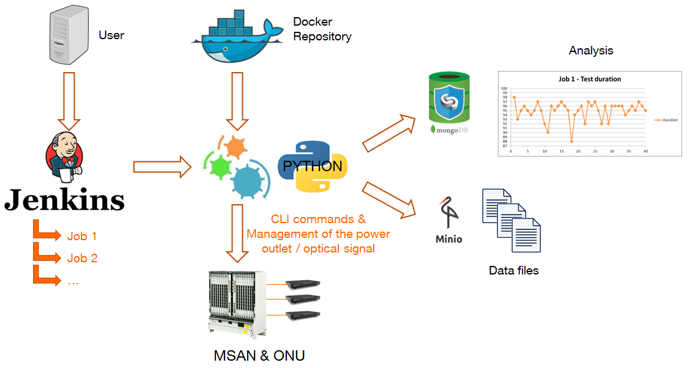
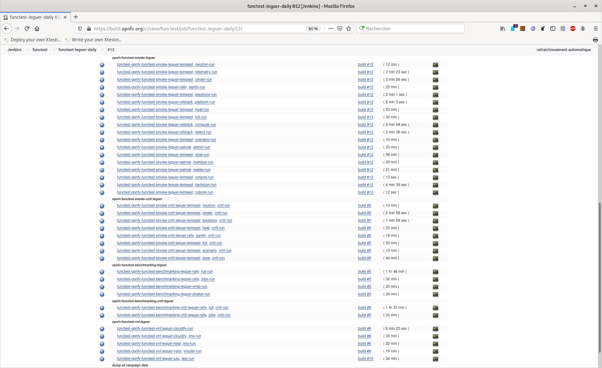

## Continuous integration


### A few CNTT reqs

- OPNFV has built a complete CI/CD toolchain for continuously deploying and
  testing cloud infrastructure
- Reference conformance only requires for the local deployment of the
  same components
- all test cases must be delivered as **Docker containers** including the
  common test case execution and the unified way to manage all the interactions

**Integrate smoothly and deploy fastly**


### How OPNFV/CNTT helps?

- **Functest** offers a collection of state-of-the-art virtual infrastructure
  test suites
- **Xtesting** helps assembling sparse test cases and accelerating the adoption
  of CI/CD best practices
- **XtestingCI** eases deploying anywhere plug-and-play CI/CD toolchains in a
  few commands
- **CNTT** defines conformance suites and its playbooks leveraging this 3
  testing frameworks

**Leverage best opensource tools and practices**


### Testing [FTTH](https://en.wikipedia.org/wiki/Fiber_to_the_x) equipment




### Deploy your CI toolchain

```
virtualenv xtesting
. xtesting/bin/activate
pip install ansible
ansible-galaxy install collivier.xtesting
git clone https://gerrit.opnfv.org/gerrit/functest-xtesting functest-xtesting-src
ansible-playbook functest-xtesting-src/ansible/site.yml
deactivate
rm -rf functest-xtesting-src xtesting
```

**More scenarios in [[1]](https://wiki.opnfv.org/pages/viewpage.action?pageId=32015004)**


## Testing


### Verif', Compliance and Interop'

- verification allows skipping test if optional services or capabilities are
  missing
- compliance forces the full API descriptions as currently proposed by
  CNTT and then skips all optional capability testing
- the opensource certifications are driven by simple interoperability testing
  (RefStack and OVP are about less than 10% of Functest. **trustability?**)

**Fine tune the same test frameworks**


### [CNTT RC1](https://build.opnfv.org/ci/view/functest/job/functest-leguer-daily/12/)




## Conclusion


### Key takeaways

- **test integration requirements** are crucial to smoothly assemble all
  test cases
- leverage **existing** OPNFV testing knowledge (projects) and experience
  (history) by utilising the OPNFV toolchain design already in-place
- **3000+** functional tests, **3 hours** upstream API and dataplane benchmarks
  and VNFs automatically onboarded and tested **can be reused asis**

**Keep it simple and do not reivent the wheel**
