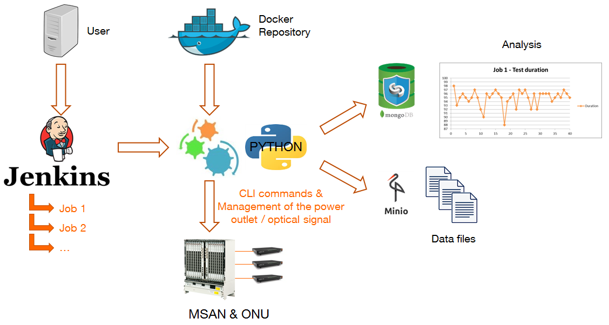

# From Paris to Stockholm

[Cédric Ollivier](mailto:cedric.ollivier@orange.com)

2019/06/09

## Agenda

### Agenda

- Functest and Xtesting in a nutshell
- what's new from Paris (Iruya and J-release)?
  - code improvement
  - functional gates
  - switch to python3
  - Raspberry PI
- what's next? GSMA, CNF, ...

## Infrastructure verification

### Functest in a nutshell

- verify any kind of OpenStack and Kubernetes deployments (OPNFV model)
  including production environments
- conform with upstream rules (OpenStack gate jobs and Kubernetes conformance
  tests)
- ensure that the platforms meet Network Functions Virtualization requirements

### Functest suites

- all functional tests as defined by the upstream communities (e.g. Tempest,
  neutron-tempest-api, Barbican, Patrole...)
- upstream API and dataplane benchmarking tools (Rally, Vmtp and Shaker)
- Virtual Network Function deployments and testing (vIMS, vRouter and vEPC)

### Network automation journey

### Xtesting in a nutshell

- allow the developer to work only on the test suites without diving into
  CI/CD integration
- simplify test integration in a complete LFN-based CI/CD toolchain (e.g.
  Jenkins, Testing Containers, Test API and dashboard)
- allow a proper design and verify multiple components in the same CI/CD
  toolchain (OpenStack, Kubernetes, ONAP, etc.)

**Easy to use and very useful for any CI/CD toolchain**

### Chained CI

<!-- .element: style="border: 0" -->

### Testing [FTTH](https://en.wikipedia.org/wiki/Fiber_to_the_x) equipment

<!-- .element: style="border: 0; width: 90%" -->

### Demo

- describe the testcase execution
- build and publish your container
- list your test in the toolchain description
- deploy your own toolchain in a few commands

https://wiki.opnfv.org/pages/viewpage.action?pageId=32015004

## What's new from Paris (Iruya and J-release)

### Code improvement

- all patches are now verified by [bandit](https://github.com/PyCQA/bandit) (in
  addition to yamllint, pep8, pylint, ansible-lint and bashate. Please see
  [tox.ini](https://git.opnfv.org/functest/tree/tox.ini) for details).
- 10/10 by pylint is now enforced for all
  Functest packages

**we still need python3.6 in build servers to run our unit tests vs python3**

### Functional Gates

- live-migration, vmtp and shaker are now verified in all gates (pre and post
  merge)
- Functest is continuously executed up to 4 tests in parallel verifying our
  reference Openstack/Kubernetes
- we continuously check the remaining resources after multiple runs (they only
  remain a few region and volume leaks which are being fixed)

### Switch to python3

- all latest Functest containers switched to python3 as default (Functest has
  supported both python2 and python3 via six for a while)
- all missing decode/encode calls are backported to Hunter and Iruya
- vtmp has been updated to keep the same testcase list
- our patch about Cloudify REST client will be published upstream if the
  project is still active

### Raspberry PI

- travis-ci.org allows us to continuously cross-compile containers (Hunter,
  Iruya and latest) for arm (Raspberry PI) and arm64
- no additional configuration is required (Docker manifest allows an unify way
  to run the containers whatever the architectures)
- only testcases leveraging on go have not yet been ported (juju_epc and
  Kubernetes conformance tests)

**Try it, and you will love it!**

### New testcases

- refstack_platform and refstack_object (already part of tempest_full) are now
  dedicated testcases in Functest
- tempest_slow is on our agenda to keep conforming with OpenStack gates
- a few indentified opportunities about
[CNF](https://www.cncf.io/announcement/2019/02/25/cncf-launches-cloud-native-network-functions-cnf-testbed/):
[Clearwater Ims via Kubernetes](https://github.com/Metaswitch/clearwater-docker/)
and [xrally-kubernetes](https://github.com/xrally/xrally-kubernetes)
- GSMA should come with new testcases needs (Functest can already be executed
  vs the current profiles)

## Conclusion

### Takeaways

- Xtesting is a key helper from first tests to full end2end service testing
- Functest allows verifying production Infrastructure and is breaking the
  classical preproduction/production model
- And we are still pushing the limits:
  - python packages
  - GNU/Linux packages

**Upstream first! Try them, and you will love them! **

## Thank you
