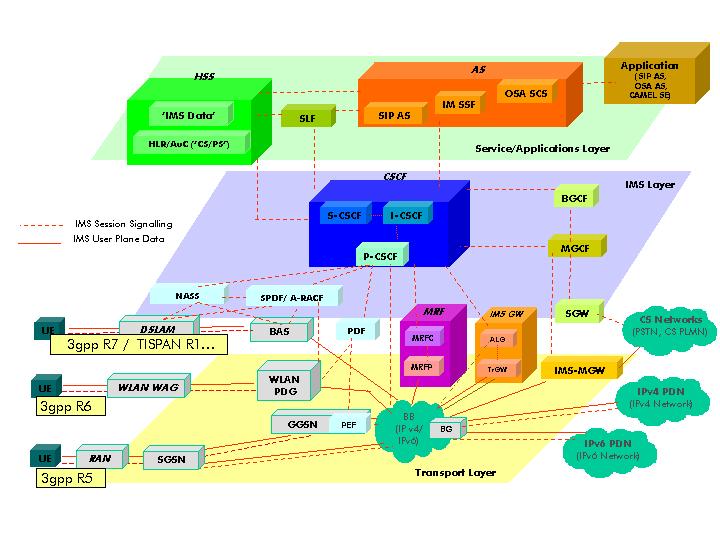

===========================
OPNFV functional test guide
===========================

Testing is a key challenge of OPNFV.
It shall be possible to run functional tests on any OPNFV solution.

The goal of this document consists in
* a description of functional tests for OPNFV
* a description of the tools needed to perform these tests
* the procedure to configure the tools and the scenarios associated with these tests

Functional tests shall be automated and collected results shall be used to improve the robustness and the reliability of the overall system. 

Function tests may cover any domain that could lead to improve the OPNFV solution and define "Telco Cloud" KPI.

The last section also describes how to automate these tests within the OPNFV continuous integration project.

.. _ETSI: http://docbox.etsi.org/ISG/NFV/Open/Published/gs_NFV001v010101p%20-%20Use%20Cases.pdf

ETSI NFV defined 9 use cases (ref ETSI_):
 * VNF as a Service
 * NFV as a service
 * VNF Forwarding graphs
 * Virtual Network Platform as a Service
 * Virtualisation of Mobile Core and IMS
 * Virtualisation of Mobile station
 * Fixed Access NFV
 * Virtualization of CDNs (vCDN)
 * Virtualization of the Home environment

.. _`Openstack Telco Working Group`: https://wiki.openstack.org/wiki/TelcoWorkingGroup

Most of the use cases are also discussed in upstream projects (e.g. `Openstack Telco Working Group`_ )

For release 1 (Arno), 5 test suites have been selected:
 * Rally Bench test suite for Openstack
 * Openstack Tempest test suite
 * OpenDaylight test suite
 * vPing
 * vIMS

The 3 first suites are directly inherited from upstream projects.
vPing, that is already present in Tempest suite, has been developped to provided a basic "hellow world" functional test example.

.. _`Continuous Integration`: https://build.opnfv.org/ci/view/functest/

vEPC, vPE, vHGW, vCDN use cases are not considered for first release.
It does not mean that such use cases cannot be tested on OPNFV Arno.
It means that these use cases have not been integrated in the `Continuous Integration`_ and no specific work (integration or developpment) have been done for R1.

.. _prereqs:

-------------
Prerequisites
-------------
We assume that an OPNFV solution has been installed.

.. _here: TBC

The installation of the OPNFV solution is out of scope of this document but can be found [here_].
In the rest of the document the OPNFV solution would be considered as the System Under Test (SUT).

The installation and configuration of the tools needed to perform the tests will be described in the following sections.

For release 1, the tools are not automatically installed.

.. _pharos: https://wiki.opnfv.org/pharos

It is recommended to install the different tools on the jump host server as defined in the pharos_ project.
The high level architecture can be described as follow:

code::

 CIMC/Lights+out management                  Admin     Private   Public   Storage
                                              PXE
                                                                   +
 +                                             +     IP_PRIV/24    |        |
 |                                             |         +         +        |
 |                                             |         |    IP_PUB/24     |
 |     +-----------------+                     |         |         +        |
 |     |                 |                     |         |         |        |
 +-----+  Jumpserver     |                     |         |         |        |
 |     |                 +---------------------+         |         |        |
 |     |                 |                     |         |         |        |
 |     |  +----------+   |                     |         |         |        |
 |     |  |  Rally   |   +---- --------------------------+         |        |
 |     |  |          |   |                     |         |         |        |
 |     |  |  Robot   |   |                     |         |         |        |
 |     |  |          |   |                     |         |         |        |
 |     |  |  vPing   |   |                     |         |         |        |
 |     |  |          |   |                     |         |         |        |
 |     |  |  vIMS    |   |                     |         |         |        |
 |     |  +----------+   |                     |         |         |        |
 |     |   FuncTests     +-----------------------------------------+        |
 |     |                 |                     |         |         |        |
 |     |                 +--------------------------------------------------+
 |     |                 |                     |         |         |        |
 |     +-----------------+                     |         |         |        |
 |                                             |         |         |        |
 |    +----------------+                       |         |         |        |
 |    |             1  |                       |         |         |        |
 +----+ +--------------+-+                     |         |         |        |
 |    | |             2  |                     |         |         |        |
 |    | | +--------------+-+                   |         |         |        |
 |    | | |             3  |                   |         |         |        |
 |    | | | +--------------+-+                 |         |         |        |
 |    | | | |             4  |                 |         |         |        |
 |    +-+ | | +--------------+-+               |         |         |        |
 |      | | | |             5  +---------------+         |         |        |
 |      +-+ | |  nodes for     |               |         |         |        |
 |        | | |  deploying     +-------------------------+         |        |
 |        +-+ |  opnfv         |               |         |         |        |
 |          | |     SUT        +-----------------------------------+        |
 |          +-+                |               |         |         |        |
 |            |                +--------------------------------------------+
 |            +----------------+               |         |         |        |
 |                                             |         |         |        |
 |                                             +         +         +        +

.. _description:

-----------------------------
Description of the test cases
-----------------------------

Rally bench test suite
======================

.. _Rally: https://wiki.openstack.org/wiki/Rally

The OPNFV scenarios are based on the collection of Rally_ default scenarios:
 * authenticate
 * cinder
 * nova
 * vm
 * glance
 * keystone
 * neutron
 * quotas

The goal of this test suite is to test the different modules of OpenStack and get significant figures that could help us to define telco Cloud KPI.

This test suite provides performance information on VIM (OpenStack) part.

No SLA were defined for release 1, we just consider whether the tests are passed or failed.

In the future SLA shall be considered (e.g. accepting booting time for a given image with a given flavour).

Through its integration in Continuous Integration, the evolution of the performance of these tests shall also be considered.

Tempest
=======

.. _Tempest: http://docs.openstack.org/developer/tempest/overview.html

Tempest_ is the OpenStack Integration Test Suite. We use Rally to run Tempest suite.

The goal of this test is to check the OpenStack installation (sanity checks).

OpenDaylight
============

vPing
=====

The goal of this test can be described as follow:

code::

 vPing testcase
 +-------------+                   +-------------+
 |             |                   |             |
 |             |     Boot VM1      |             |
 |             +------------------>|             |
 |             |                   |             |
 |             |     Get IP VM1    |             |
 |             +------------------>|             |
 |   Tester    |                   |   System    |
 |             |     Boot VM2      |    Under    |
 |             +------------------>|     Test    |
 |             |  Including Ping   |             |
 |             |at the end of boot |             |
 |             |                   |             |
 |             |                   |             |
 |             |   Check console   |             |
 |             |     Grep Ping     |             |
 |             +------------------>|             |
 |             |                   |             |
 +-------------+                   +-------------+

The vPing test case is already present in Tempest suite.

This example, using OpenStack python clients can be considered as an "hellow World" example and may be modified for future use.

vIMS
====

vIMS is one of the testcases defined by ETSI.

the goal of this test consists in deploying a virtualized IP Multimedia Subsystem (vIMS) on OPNFV, configuring it to deliver services to a set of emulated SIP endpoints, deploying a virtualized test system that implements those emulated SIP endpoints, and performing a series of simple functional tests on the vIMS, including the ability to establish SIP sessions between emulated endpoints. 

This functional test will verify that
 * The OpenStack Nova API can be called to instantiate a set of VMs that together comprise a vIMS network function
 * The OpenStack Glance service is capable of serving up the required images
 * The virtual networking component of the platform can provide working IP connectivity between and among the VMs
 * The platform as a whole is capable of supporting the running of a real virtualized network function that delivers a typical service offered by a network operator, i.e. voice telephony

Functional testing of vIMS in OPNFV Release 1 will be limited to a basic, non-scalable and non-fault-tolerant deployment of IMS.
Furthermore, in this release the vIMS will perform only control plane functions (i.e. processing of SIP signaling messages) and will not be passing RTP media streams.

In future releases, the same software elements can be deployed with multiple instances of each VNF component to provide a fault tolerant and dynamically scalable deployment of IMS. With the addition of virtualized Session Border Controller software elements, the scope of vIMS functional testing can be further expanded to include the handling of RTP media. 

.. _clearwater: http://www.projectclearwater.org/

The vIMS core function is based on the clearwater_ open source solution.

.. _tooling_installation:

----------------------
Tooling installation
----------------------

2 external tools are needed for the R1 functional tests:
 * Rally
 * Robot

Rally
=====

.. _`Rally installation procedure`: https://rally.readthedocs.org/en/latest/tutorial/step_0_installation.html

.. _`OpenRC`: http://docs.openstack.org/user-guide/common/cli_set_environment_variables_using_openstack_rc.html

The Rally creation can be describe as follow (ref: `Rally installation procedure`_):
 * Create or enter a folder where you want to check out the tool repos.
 * $ git clone https://git.openstack.org/openstack/rally
 * $ ./rally/install_rally.sh
 * configure your `OpenRC`_ file to let Rally access to your OpenStack, you can either export it from Horizon or build it manually (OpenStack credentials are required)
 * $ source Your_OpenRC_file
 * $ rally deployment create --fromenv --name=my-opnfv-test
 * $ rally-manage tempest install

You can check if the configuration of rally is fine by typing 'rally deployment check', you shall see the list of available services as follow::

    # rally deployment check
    keystone endpoints are valid and following service are available:
    +-------------+-----------+------------+
    | Services  | Type        | Status     |
    +-----------+-------------+------------+
    | cinder    | volume      | Available  |
    | cinderv2  | volumev2    | Available  |
    | glance    | image       | Available  |
    | keystone  | identity    | Available  |
    | neutron   | network     | Available  |
    | nova      | compute     | Available  |
    | nova_ec2  | compute_ec2 | Available  |
    | novav3    | computev3   | Available  |
    +-----------+-------------+------------+

    # rally show images
    +--------------------------------------+----------------------------------------------+------------+
    | UUID                                 | Name                                         | Size (B)   |
    +--------------------------------------+----------------------------------------------+------------+
    | 0a15951f-6388-4d5d-8531-79e7205eb140 | cirros_2015_04_10_13_13_18                   | 13167616   |
    | 67734efd-75f6-4919-991e-bba9855f3ae1 | Ubuntu 12.04 64b                             | 260637184  |
    | b1504066-045a-4f8f-8919-8c665ef3f400 | Ubuntu 14.04 64b                             | 253297152  |
    +--------------------------------------+----------------------------------------------+------------+

    # rally show flavors
    +--------------------------------------+---------------------+-------+----------+-----------+-----------+
    | ID                                   | Name                | vCPUs | RAM (MB) | Swap (MB) | Disk (GB) |
    +--------------------------------------+---------------------+-------+----------+-----------+-----------+
    | 110e6375-a058-4af6-b21e-b765187904d2 | m1.medium           | 2     | 1024     |           | 20        |
    | 7084d7e7-415a-455d-a55a-2ad286ddf7c9 | m1.large            | 4     | 4096     |           | 80        |
    | a0345ba7-c667-4fd2-964f-7e98f8cda279 | m1.xlarge           | 4     | 8192     |           | 200       |
    | accdc28c-5e20-4859-a5cc-61cf9009e56d | m1.small            | 1     | 512      |           | 10        |
    +--------------------------------------+---------------------+-------+----------+-----------+-----------+

Robot
=====
Summary: Set up python2.7 virtual environment::

    mkvirtualenv robot

    pip install requests
    pip install robotframework
    pip install robotframework-sshlibrary
    pip install robotframework-requests

vPing
=====

Make sure that nova services are up::

    #nova service list
    +----+----------------+--------+----------+---------+-------+
    | Id | Binary         | Host   | Zone     | Status  | State |
    +----+----------------+--------+----------+---------+-------+
    | 1  | nova-conductor | xxxxxx | internal | enabled | up    |
    | 3  | nova-network   | xxxxxx | internal | enabled | up    |
    | 4  | nova-scheduler | xxxxxx | internal | enabled | up    |
    | 5  | nova-compute   | xxxxxx | nova     | enabled | up    |
    +----+----------------+--------+----------+---------+-------+

.. _vPing.py: https://git.opnfv.org/cgit/functest/tree/testcases/vPing/CI/libraries/vPing.py

Retrieve vPing.py_ script from OPNFV git repo

Make sure you have sourced your OpenRC file::

    # source Your_OpenRC_file

------------------------------
Functional test configuration
------------------------------

Rally bench suite
=================

Rally bench scenarios have been aggregated in json files.
A script has been developed to simplify the management of the tests and the integration in CI, get it from git::

    # wget https://git.opnfv.org/cgit/functest/tree/testcases/VIM/OpenStack/CI/libraries/run_rally.py

Several scenarios are available (all based on native Rally scenarios):
 * glance
 * nova
 * authenticate
 * keystone
 * neutron
 * vm
 * quotas
 * request
 * tempest
 * all (every module except tempest)

You can run the script as follow::

    # python run_rally.py keystone

The script will:
 * get the json scenario (if not already available) and put it into the scenario folder
 * run rally
 * generate the html result page into the result folder as opnfv-[module name]-[timestamp].html
 * generate the json result page into the result folder as opnfv-[module name]-[timestamp].json
 * generate OK or KO

Tempest suite
=============

It is possible to use Rally to perform Tempest tests (ref: `tempest installation guide using Rally`_)
You just need to run::

     # rally verify start

The different modes available are smoke, baremetal, compute, data_processing, identity, image, network, object_storage, orchestration, telemetry, and volume. By default if you do not precise anything then smoke tests be selected by default.

.. _`tempest installation guide using Rally`: https://www.mirantis.com/blog/rally-openstack-tempest-testing-made-simpler/

OpenDaylight
============
ODL wiki page describes system preparation and running tests. See `Integration Group CSIT`_.

.. _`Integration Group CSIT`: https://wiki.opendaylight.org/view/CrossProject:Integration_Group:CSIT

vPing
=====

By default, the script’s is configured as follow::

 * OS_USERNAME:         admin
 * OS_PASSWORD:         test
 * OS_AUTH_URL:          http://192.168.20.71:5000/v2.0
 * OS_TENANT_NAME: invisible_to_admin
 * Name of VM: opnfv-vping-1 , opnfv-vping-2
 * Flavor: m1.small
 * Image: Ubuntu 14.04 (amd64)
 * Network: private

The script needs to be tuned to  your specific system configuration

vIMS
====

.. _manualtest:

--------------
Test results
--------------

Rally bench suite
=================

Results are available in the result folder through a html page and a json file.

Tempest suite
=============

You can get the results of tempest by typing::

    # rally verify list

OpenDaylight
============

Tests can be executed with script *start_test.sh* from directory *functest/testcases/Controllers/ODL/CI*. For usage example see::

    # bash start_test.sh -h

vPing
=====
The test can be executed with command::

    #python vPing.py

vIMS
====

.. _automatictest:

------------------
Testing Automation
------------------

Connection of your platform
===========================
If you want to add your platform to the community automation, you need to declare your machine as a Jenkins slave.
 * Send a mail to OPNFV LF Helpdesk (opnfv-helpdesk@rt.linuxfoundation.org)
 * Create a local user jenkins on your machine
 * wget http://mirrors.jenkins-ci.org/war/1.599/jenkins.war
 * Extract contents, find the file named slave.jar and copy it to somewhere which jenkins user created in first step can access.
 * Create a directory /home/jenkins/opnfv_slave_root
 * check the java version (>1.7.0_75)
 * Contact Linux Foundation to manage authentication of your server
 * A key/token will be produced. Establish connection towards OPNFV Jenkins by using below command: java -jar slave.jar -jnlpUrl https://build.opnfv.org/ci/computer/<slave_name>/slave-agent.jnlp -secret <token>

Continuous integration scripts
==============================

.. _references:

----------
References
----------

OPNFV main site: opnfvmain_.

OPNFV functional test page: opnfvfunctest_.

IRC support chan: #opnfv-testperf

.. _opnfvmain: http://www.opnfv.org
.. _opnfvfunctest: https://wiki.opnfv.org/opnfv_functional_testing
