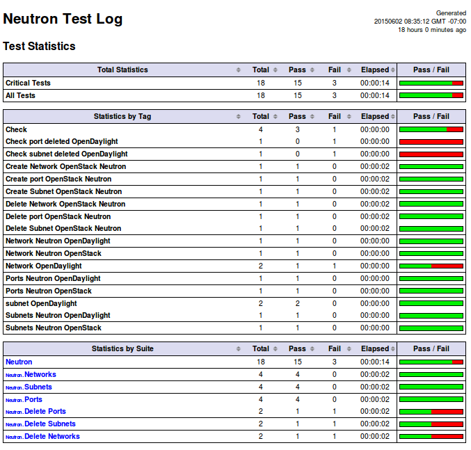

===========================
OPNFV functional test guide
===========================

.. contents::

------------
Introduction
------------

Testing is a key challenge of OPNFV.
It shall be possible to run functional tests on any OPNFV solution.

The goal of this document consists in
 * a description of functional tests for OPNFV
 * a description of the tools needed to perform these tests
 * the procedure to configure the tools and the scenarios associated with these tests

Functional tests shall be automated (as much as possible) and collected results shall be used to improve the robustness and the reliability of the overall system.

Function tests may cover any domain that could lead to improve the OPNFV solution and define "Telco Cloud" KPI.

The last section also describes how to automate these tests within the OPNFV continuous integration project.

.. _ETSI: http://docbox.etsi.org/ISG/NFV/Open/Published/gs_NFV001v010101p%20-%20Use%20Cases.pdf

ETSI NFV defined 9 use cases (ref ETSI_):
 * VNF as a Service
 * NFV as a service
 * VNF Forwarding graphs
 * Virtual Network Platform as a Service
 * Virtualisation of Mobile Core and IMS
 * Virtualisation of Mobile station
 * Fixed Access NFV
 * Virtualization of CDNs (vCDN)
 * Virtualization of the Home environment

.. _`Openstack Telco Working Group`: https://wiki.openstack.org/wiki/TelcoWorkingGroup
.. _`functest guide`: https://wiki.opnfv.org/_media/opnfv-_functest.pdf

Most of the use cases are also discussed in upstream projects (e.g. `Openstack Telco Working Group`_ )

For release 1 (Arno), 4 test suites have been selected:
 * Rally Bench test suite for Openstack
 * Openstack Tempest test suite
 * OpenDaylight test suite
 * vPing

The 3 first suites are directly inherited from upstream projects.
vPing, that is already present in Tempest suite, has been developped to provided a basic "hello world" functional test example.

.. _`Continuous Integration`: https://build.opnfv.org/ci/view/functest/

vIMS, vEPC, vPE, vHGW, vCDN, vWhatever use cases are not considered for first release.
It does not mean that such use cases cannot be tested on OPNFV Arno.
It means that these testcases have not been integrated in the `Continuous Integration`_ and no specific work (integration or developpment) have been done for the first release.
We may expect that new VNFs and new scenarios will be created and integrated in the future releases. See `functest guide`_ for details.

.. _prereqs:

-------------
Prerequisites
-------------
We assume that an OPNFV Arno solution has been installed.

.. _here: https://wiki.opnfv.org/documentation/Arno

The installation of the OPNFV solution is out of scope of this document but can be found [here_].
In the rest of the document the OPNFV solution would be considered as the System Under Test (SUT).

The installation and configuration of the tools needed to perform the tests will be described in the following sections.

For release 1, the tools are automatically installed, but the tests are not fully automated due to the requirement that sourcing of OpenStack credentials is required on at least one machine where tests are launched. More details will be provided in the configuration section.

.. _pharos: https://wiki.opnfv.org/pharos

It is recommended to install the different tools on the jump host server as defined in the pharos_ project.
The high level architecture can be described as follow::

 CIMC/Lights+out management                  Admin     Private   Public   Storage
                                              PXE
                                                                   +
 +                                             +     IP_PRIV/24    |        |
 |                                             |         +         +        |
 |                                             |         |    IP_PUB/24     |
 |     +-----------------+                     |         |         +        |
 |     |                 |                     |         |         |        |
 +-----+  Jumpserver     |                     |         |         |        |
 |     |                 +---------------------+         |         |        |
 |     |                 |                     |         |         |        |
 |     |  +----------+   |                     |         |         |        |
 |     |  |  Rally   |   +---- --------------------------+         |        |
 |     |  |          |   |                     |         |         |        |
 |     |  |  Robot   |   |                     |         |         |        |
 |     |  |          |   |                     |         |         |        |
 |     |  |  vPing   |   |                     |         |         |        |
 |     |  |          |   |                     |         |         |        |
 |     |  | Tempest  |   |                     |         |         |        |
 |     |  +----------+   |                     |         |         |        |
 |     |   FuncTests     +-----------------------------------------+        |
 |     |                 |                     |         |         |        |
 |     |                 +--------------------------------------------------+
 |     |                 |                     |         |         |        |
 |     +-----------------+                     |         |         |        |
 |                                             |         |         |        |
 |    +----------------+                       |         |         |        |
 |    |             1  |                       |         |         |        |
 +----+ +--------------+-+                     |         |         |        |
 |    | |             2  |                     |         |         |        |
 |    | | +--------------+-+                   |         |         |        |
 |    | | |             3  |                   |         |         |        |
 |    | | | +--------------+-+                 |         |         |        |
 |    | | | |             4  |                 |         |         |        |
 |    +-+ | | +--------------+-+               |         |         |        |
 |      | | | |             5  +---------------+         |         |        |
 |      +-+ | |  nodes for     |               |         |         |        |
 |        | | |  deploying     +-------------------------+         |        |
 |        +-+ |  opnfv         |               |         |         |        |
 |          | |     SUT        +-----------------------------------+        |
 |          +-+                |               |         |         |        |
 |            |                +--------------------------------------------+
 |            +----------------+               |         |         |        |
 |                                             |         |         |        |
 |                                             +         +         +        +

.. _description:

-----------------------------
Description of the test cases
-----------------------------

vPing
=====

The goal of this test can be described as follow::

 vPing testcase
 +-------------+                   +-------------+
 |             |                   |             |
 |             |                   |             |
 |             |     Boot VM1      |             |
 |             +------------------>|             |
 |             |                   |             |
 |             |     Get IP VM1    |             |
 |             +------------------>|             |
 |   Tester    |                   |   System    |
 |             |     Boot VM2      |    Under    |
 |             +------------------>|     Test    |
 |             | VM2 pings VM1     |             |
 |             |                   |             |
 |             | Check console log |             |
 |             |    If ping:       |             |
 |             |      exit OK      |             |
 |             |    else (timeout) |             |
 |             |      exit KO      |             |
 |             |                   |             |
 |             |                   |             |
 +-------------+                   +-------------+

This example, using OpenStack Python clients can be considered as an "Hello World" example and may be modified for future use.

OpenDaylight
============

The ODL suite consists in a set of basic tests inherited from ODL project. The suite tests the creation and deletion of network, subnet, port though OpenDaylight and Neutron.

The list of tests can be described as follow:
 * Restconf.basic: Get the controller modules via Restconf
 * Neutron.Networks

   * Check OpenStack Networks :: Checking OpenStack Neutron for known networks
   * Check OpenDaylight Networks :: Checking OpenDaylight Neutron API
   * Create Network :: Create new network in OpenStack
   * Check Network :: Check Network created in OpenDaylight
   * Neutron.Networks :: Checking Network created in OpenStack are pushed

 * Neutron.Subnets

   * Check OpenStack Subnets :: Checking OpenStack Neutron for known Subnets
   * Check OpenDaylight subnets :: Checking OpenDaylight Neutron API
   * Create New subnet :: Create new subnet in OpenStack
   * Check New subnet :: Check new subnet created in OpenDaylight
   * Neutron.Subnets :: Checking Subnets created in OpenStack are pushed

 * Neutron.Ports

   * Check OpenStack ports :: Checking OpenStack Neutron for known ports
   * Check OpenDaylight ports :: Checking OpenDaylight Neutron API
   * Create New Port :: Create new port in OpenStack
   * Check New Port :: Check new subnet created in OpenDaylight
   * Neutron.Ports :: Checking Port created in OpenStack are pushed

 * Delete Ports

   * Delete previously created subnet in OpenStack
   * Check subnet deleted in OpenDaylight
   * Check subnet deleted in OpenStack

 * Delete network

   * Delete previously created network in OpenStack
   * Check network deleted in OpenDaylight
   * Check network deleted in OpenStack

 *

Rally bench test suite
======================

.. _Rally: https://wiki.openstack.org/wiki/Rally

Rally bench test suite consist in a suite of light performance tests on some of the OpenStack components.

The goal of this test suite is to test the different modules of OpenStack and get significant figures that could help us to define telco Cloud KPI.

The OPNFV scenarios are based on the collection of the existing Rally_ scenarios:
 * authenticate
 * cinder
 * nova
 * requests
 * glance
 * keystone
 * neutron
 * quotas

This test suite provides performance information on VIM (OpenStack) part.

No SLA were defined for release 1, we just consider whether the tests are passed or failed.

In the future SLA shall be defined (e.g. accepting booting time for a given image with a given flavour).

Through its integration in Continuous Integration, the evolution of the performance of these tests shall also be considered.

Tempest
=======

.. _Tempest: http://docs.openstack.org/developer/tempest/overview.html

Tempest_ is the OpenStack Integration Test Suite. We use Rally to run Tempest suite.

The Tempest.conf configuration file is automatically generated by Rally then the Tempest suite is run, each test duration is measured.

We considered the smoke test suite for Arno.

The goal of this test is to  to check the basic OpenStack functionality on a fresh installation.

.. _tooling_installation:

----------------------
Tooling installation
----------------------

2 external tools are needed for the functional tests on Arno:
 * Rally
 * Robot

Rally is used for benchmarking and running Tempest. Robot is used for running OpenDaylight test suites.

A script (config_test.py) has been created to simplify as much as possible the installation of the different suites of tests.

This script config_test.py_ is hosted in OPNFV repository and uses the configuration file config_functest.yaml_::

 usage: config_functest.py [-h] [-d] [-f] path action

 positional arguments:
  repo_path    path to the repository
  action       Possible actions are: 'start|check|clean'

 optional arguments:
  -h, --help   show this help message and exit
  -d, --debug  Debug mode
  -f, --force  used to avoid prompting the user for confirmation when cleaning functest environment.

Actions
 * start: will prepare the functional testing environment
 * check: will check the configuration (scenarios available, environment variables properly set, networks,..)
 * clean: will clean the functional test environement if existing

This script will:
 * Install Rally environment
 * Install Robot environment
 * Install Tempest
 * Retrieve test scenarios
 * Create temporary neutron private network (if needed)
 * Create Glance images

When integrated in CI, the only prerequisite consists in retrieving the OpenStack credentials (rc file).
This file shall be saved on the jumphost. It must be sourced by the user (who shall have sudo rights) executing the tests. 

For the Continuous Integration we store this file under $HOME/functest/opnfv-openrc.sh on the jumphost server so CI can automatically execute the suite of tests

The procedure to set up functional testing environment can be described as follow:

Log on the Jumphost server. Be sure you are no root then execute::

    [user@jumphost]$ mkdir <Your_functest_directory>
    [user@jumphost]$ cd <Your_functest_directory>
    [user@jumphost]$ git clone https://git.opnfv.org/functest
    [user@jumphost]$ cd testcases/

Modify and adapt needed parameters in the config_functest.yaml. Follow the instructions below.

Retrieve OpenStack source file (configure your `OpenRC`_ file to let Rally access to your OpenStack, you can either export it from Horizon or build it manually (OpenStack credentials are required)::

    [user@jumphost]$ source Your_OpenRC_file
    [user@jumphost]$ python <functest_repo_directory>/config_functest.py -d <Your_functest_directory> start

At the end of the git clone, the tree of <functest_repo_directory> will have the following structure::

 |-- docs/
 |   |-- functest.rst
 |   |-- images
 |        |-- Ims_overview.png
 |-- INFO
 |-- LICENSE
 |-- testcases/
      |-- config_functest.py
      |-- config_functest.yaml
      |-- Controllers/
      |     |-- ODL/
      |          |-- CI/
      |          |    |-- create_venv.sh
      |          |    |-- custom_tests/
      |          |    |    |-- neutron
      |          |    |-- integration/
      |          |    |    |-- distributions
      |          |    |    |-- features
      |          |    |    |-- feature-selector
      |          |    |    |-- packaging
      |          |    |    |-- pom.xml
      |          |    |    |-- test
      |          |    |    |-- vm
      |          |    |-- logs
      |          |    |-- requirements.pip
      |          |    |-- start_tests.sh
      |          |    |-- test_list.txt
      |          |-- ODL.md
      |-- functest_utils.py
      |-- VIM/
      |   |-- OpenStack/
      |       |-- CI/
      |       |   |-- libraries/
      |       |   |    |-- run_rally.py
      |       |   |-- suites/
      |       |        |-- opnfv-authenticate.json
      |       |        |-- opnfv-cinder.json
      |       |        |-- opnfv-glance.json
      |       |        |-- opnfv-heat.json
      |       |        |-- opnfv-keystone.json
      |       |        |-- opnfv-neutron.json
      |       |        |-- opnfv-nova.json
      |       |        |-- opnfv-quotas.json
      |       |        |-- opnfv-requests.json
      |       |        |-- opnfv-smoke-green.json
      |       |        |-- opnfv-smoke.json
      |       |        |-- opnfv-tempest.json
      |       |        |-- opnfv-vm.json
      |       |-- OpenStack.md
      |-- vPing/
          |-- CI/
              |-- libraries/
                   |-- vPing.py

NOTE: the Rally environment will be installed under ~/.rally/ the default Tempest configuration (automatically generated by Rally based on OpenStack credentials) can be found under .rally/tempest/for-deployment-<deployment_id>/tempest.conf

Configuration of config_functest.yaml
=====================================

Do not change the directories structure:

    * image_name:               name of the image that will be created in Glance
    * image_url:                URL of the image to be downloaded
    * image_disk_format:        glance image disk format (raw, qcow2, ...)

    * neutron_private_net_name:     name of an OpenStack private network. If not existing, it will be created
    * neutron_private_subnet_name:  private subnet network to be created if not existing
    * neutron_private_subnet_cidr:  range of the private subnet.
    * neutron_private_subnet_start: start IP
    * neutron_private_subnet_end:   end IP
    * neutron_router_name:          name of the router between the private and the public networks

    * ping_timeout: time out of the vPing test case
    * vm_flavor:    name of the flavor used to create the VMs
    * vm_name_1:    name of the first VM
    * vm_name_2:    name of the second VM
    * ip_1:    IP of the first VM (matching the private subnet cidr)
    * ip_2:    IP of the second VM

Please note that you need to install this environment only once.
As long as the credentials of the System Under Test do not change, there is no reason to modify the testing environment.

If you need more details on Rally installation, see `Rally installation procedure`_.

You can check if the configuration of rally is fine by typing 'rally deployment check', you shall see the list of available services as follow::

    # rally deployment check
    keystone endpoints are valid and following service are available:
    +-------------+-----------+------------+
    | Services  | Type        | Status     |
    +-----------+-------------+------------+
    | cinder    | volume      | Available  |
    | cinderv2  | volumev2    | Available  |
    | glance    | image       | Available  |
    | keystone  | identity    | Available  |
    | neutron   | network     | Available  |
    | nova      | compute     | Available  |
    | nova_ec2  | compute_ec2 | Available  |
    | novav3    | computev3   | Available  |
    +-----------+-------------+------------+

    # rally show images
    +--------------------------------------+----------------------------------------------+------------+
    | UUID                                 | Name                                         | Size (B)   |
    +--------------------------------------+----------------------------------------------+------------+
    | 0a15951f-6388-4d5d-8531-79e7205eb140 | cirros_2015_04_10_13_13_18                   | 13167616   |
    | b1504066-045a-4f8f-8919-8c665ef3f400 | Ubuntu 14.04 64b                             | 253297152  |
    +--------------------------------------+----------------------------------------------+------------+

    # rally show flavors
    +--------------------------------------+---------------------+-------+----------+-----------+-----------+
    | ID                                   | Name                | vCPUs | RAM (MB) | Swap (MB) | Disk (GB) |
    +--------------------------------------+---------------------+-------+----------+-----------+-----------+
    | 110e6375-a058-4af6-b21e-b765187904d2 | m1.medium           | 2     | 1024     |           | 20        |
    | 7084d7e7-415a-455d-a55a-2ad286ddf7c9 | m1.large            | 4     | 4096     |           | 80        |
    | a0345ba7-c667-4fd2-964f-7e98f8cda279 | m1.xlarge           | 4     | 8192     |           | 200       |
    | accdc28c-5e20-4859-a5cc-61cf9009e56d | m1.small            | 1     | 512      |           | 10        |
    +--------------------------------------+---------------------+-------+----------+-----------+-----------+

    # rally show networks
    Networks for user `admin` in tenant `admin`:
    +--------------------------------------+------------------------------+------+
    | ID                                   | Label                        | CIDR |
    +--------------------------------------+------------------------------+------+
    | 4f43c349-956f-4073-9ef6-75bf4e62a0e7 | functest-net                 | None |
    | faefaab1-e503-41fc-875b-5e3112be49ed | provider_network             | None |
    +--------------------------------------+------------------------------+------+

--------------
Manual testing
--------------

vPing
=====

You can run the vPing testcase by typing::

    [user@jumphost]$ python <functest_repo_directory>/vPing/vPing.py -d <Your_functest_directory>

OpenDaylight
============

You can run ODL suite as follow::

    [user@jumphost]$ python <functest_repo_directory>testcases/Controllers/ODL/CI/start_tests.sh

ODL wiki page describes system preparation and running tests. See `Integration Group CSIT`_.

.. _`Integration Group CSIT`: https://wiki.opendaylight.org/view/CrossProject:Integration_Group:CSIT

Rally bench suite
=================

You can run the script as follow::

    [user@jumphost]$ python <functest_repo_directory>/testcases/VIM/OpenStack/CI/libraries/run_rally.py <functest_repo_directory> <module_to_be_tested>

with <module_to_be_tested> set to:
 * authenticate
 * cinder
 * nova
 * requests
 * glance
 * keystone
 * neutron
 * quotas
 * all

The script will:
 * run rally with the selected scenario
 * generate the html result page into <result_folder>/<timestamp>/opnfv-[module name].html
 * generate the json result page into <result_folder>/<timestamp>/opnfv-[module name].json
 * generate OK or KO per test based on json result file

Tempest suite
=============

It is possible to use Rally to perform Tempest tests (ref: `tempest installation guide using Rally`_)
You just need to run::

     # rally verify start smoke

The different modes available are smoke, baremetal, compute, data_processing, identity, image, network, object_storage, orchestration, telemetry, and volume. For Arno, it was decided to focus on smoke tests.

.. _`tempest installation guide using Rally`: https://www.mirantis.com/blog/rally-openstack-tempest-testing-made-simpler/

.. _manualtest:

--------------
Test results
--------------

vPing
=====
vPing result is displayed in the console::

 Functest: run vPing
 2015-06-02 21:24:55,065 - vPing - INFO - Glance image found 'functest-img'
 2015-06-02 21:24:55,066 - vPing - INFO - Creating neutron network functest-net...
 2015-06-02 21:24:57,672 - vPing - INFO - Flavor found 'm1.small'
 2015-06-02 21:24:58,670 - vPing - INFO - Creating instance 'opnfv-vping-1' with IP 192.168.120.30...
 2015-06-02 21:25:32,098 - vPing - INFO - Instance 'opnfv-vping-1' is ACTIVE.
 2015-06-02 21:25:32,540 - vPing - INFO - Creating instance 'opnfv-vping-2' with IP 192.168.120.40...
 2015-06-02 21:25:38,614 - vPing - INFO - Instance 'opnfv-vping-2' is ACTIVE.
 2015-06-02 21:25:38,614 - vPing - INFO - Waiting for ping...
 2015-06-02 21:26:42,385 - vPing - INFO - vPing detected!
 2015-06-02 21:26:42,385 - vPing - INFO - Cleaning up...
 2015-06-02 21:26:54,127 - vPing - INFO - Deleting network 'functest-net'...
 2015-06-02 21:26:55,349 - vPing - INFO - vPing OK

OpenDaylight
============
.. _`functest wiki (ODL section)`: https://wiki.opnfv.org/r1_odl_suite

The results of ODL tests can be seen in the console:: 

 ==============================================================================
 Basic
 ==============================================================================
 Basic.010 Restconf OK :: Test suite to verify Restconf is OK
 ==============================================================================
 Get Controller Modules :: Get the controller modules via Restconf     | PASS |
 ------------------------------------------------------------------------------
 Basic.010 Restconf OK :: Test suite to verify Restconf is OK          | PASS |
 1 critical test, 1 passed, 0 failed
 1 test total, 1 passed, 0 failed
 ==============================================================================
 Basic                                                                 | PASS |
 1 critical test, 1 passed, 0 failed
 1 test total, 1 passed, 0 failed
 ==============================================================================
 Output:  /home/jenkins-ci/workspace/functest-opnfv-jump-2/output.xml
 Log:     /home/jenkins-ci/workspace/functest-opnfv-jump-2/log.html
 Report:  /home/jenkins-ci/workspace/functest-opnfv-jump-2/report.html

 ..............................................................................

 Neutron.Delete Networks :: Checking Network deleted in OpenStack a... | FAIL |
 2 critical tests, 1 passed, 1 failed
 2 tests total, 1 passed, 1 failed
 ==============================================================================
 Neutron :: Test suite for Neutron Plugin                              | FAIL |
 18 critical tests, 15 passed, 3 failed
 18 tests total, 15 passed, 3 failed
 ==============================================================================
 Output:  /home/jenkins-ci/workspace/functest-opnfv-jump-2/output.xml
 Log:     /home/jenkins-ci/workspace/functest-opnfv-jump-2/log.html
 Report:  /home/jenkins-ci/workspace/functest-opnfv-jump-2/report.html

3 result files are generated:
 * output.xml
 * log.html
 * report.html

 ODL result page

Known issues
------------

Tests are expected to fail now:
 * Check port deleted in OpenDaylight
 * Check subnet deleted in OpenDaylight
 * Check Network deleted in OpenDaylight

These failures to delete objects in OpenDaylight (when removed via OpenStack Neutron) are due to the following bug: https://bugs.opendaylight.org/show_bug.cgi?id=3052.

More details on `functest wiki (ODL section)`_

Rally bench suite
=================

.. _`functest wiki (Rally section)`: https://wiki.opnfv.org/r1_rally_bench

Results are available in the result folder through a html page and a json file.

It generates a result page per module and can be described as follow.

Known issues
------------
- some tests of Cinder suite may be failed due to time-out (timer could probably be extended in the configuration file)
- some test of Nova & Neutron suite may fail due to network issues (previously created network not properly cleaned and/or quota exceeded because of created ressources that have not be properly cleaned) or ODL bugs (see `ODL bug lists`_).

More details on `functest wiki (Rally section)`_.

Tempest suite
=============

You can get the results of tempest by typing::

    # rally verify list

You shall see the results as follow::

    Total results of verification:

    +--------------------------------------+--------------------------------------+----------+-------+----------+----------------------------+----------+
    | UUID                                 | Deployment UUID                      | Set name | Tests | Failures | Created at                 | Status   |
    +--------------------------------------+--------------------------------------+----------+-------+----------+----------------------------+----------+
    | 0144c50f-ab03-45fb-9c36-242ad6440b46 | d9e1bb21-8e36-4d89-b137-0c852dbb308e | smoke    | 87    | 32       | 2015-05-05 16:36:00.986003 | finished |
    +--------------------------------------+--------------------------------------+----------+-------+----------+----------------------------+----------+

If you run this test several times, you will see as many lines as test attempts.

You can get more details on the test by typing::

    # rally verify show --uuid <UUID of the test>
    # rally verify detailed --uuid <UUID of the test>

"show" will show you all the restults including the time needed to execute the test.
"detailed" will display additional elements (errors)

Example of test result display::

    +------------------------------------------------------------------------------------------------------------------------------------------------------------+-----------+--------+
    | name                                                                                                                                                       | time      | status |
    +------------------------------------------------------------------------------------------------------------------------------------------------------------+-----------+--------+
    | tempest.api.network.test_routers.RoutersTest.test_create_show_list_update_delete_router[id-f64403e2-8483-4b34-8ccd-b09a87bcc68c,smoke]                     | 0.011466  | FAIL   |
    | tempest.api.network.test_security_groups.SecGroupIPv6Test.test_create_list_update_show_delete_security_group[id-bfd128e5-3c92-44b6-9d66-7fe29d22c802,smoke]| 1.234566  | OK     |
    | tempest.api.network.test_security_groups.SecGroupIPv6Test.test_create_show_delete_security_group_rule[id-cfb99e0e-7410-4a3d-8a0c-959a63ee77e9,smoke]       | 1.060221  | OK     |
    | tempest.api.network.test_security_groups.SecGroupIPv6Test.test_list_security_groups[id-e30abd17-fef9-4739-8617-dc26da88e686,smoke]                         | 0.060797  | OK     |
    | tempest.api.network.test_security_groups.SecGroupTest.test_create_list_update_show_delete_security_group[id-bfd128e5-3c92-44b6-9d66-7fe29d22c802,smoke]    | 0.685149  | OK     |
    | tempest.api.network.test_security_groups.SecGroupTest.test_create_show_delete_security_group_rule[id-cfb99e0e-7410-4a3d-8a0c-959a63ee77e9,smoke]           | 0.730561  | OK     |
    | tempest.api.network.test_security_groups.SecGroupTest.test_list_security_groups[id-e30abd17-fef9-4739-8617-dc26da88e686,smoke]                             | 0.116862  | OK     |
    | tempest.api.object_storage.test_account_quotas.AccountQuotasTest                                                                                           | 0.0       | SKIP   |
    | ...                                                                                                                                                        |   ...     |  ...   |

Known issues
------------

.. _`Rally patch`: https://review.openstack.org/#/c/187481/
.. _`automatically generated tempest.conf`: https://github.com/openstack/rally/blob/master/rally/verification/tempest/config.py
.. _`functest wiki (Tempest section)`: https://wiki.opnfv.org/r1_tempest
.. _`ODL bug lists`: https://bugs.opendaylight.org/buglist.cgi?component=General&product=neutron&resolution=---

Several tests are declared as failed. They can be divided in 3 main categories:
 * Invalid credentials (10 errors)
 * Multiple possible networks found, use a Network ID to be more specific.
 * Network errors

The "Invalid Credential" error is not an error. Adding "admin_domain_name=default" in the tempest.conf file generated by Rally will lead to successful tests. A `Rally patch`_ has been proposed to Rally community.

The Multiple possible netwok error occurs several times and may have different origins. It indicates that the test needs a network context to be run properly. A change in the `automatically generated tempest.conf`_ file could allow to precise the network ID.

The network errors are various and dealing with all the aspects of networking: create/update/delete network/subnet/port/router. Some may be due to (possible) bug in tempest when it tries to delete networks which should not be there for the following tests. Some may be caused by the ODL bugs, several bugs related to tempest are already reported in `ODL bug lists`_.

The follow-up of these tests can be found on the `functest wiki (Tempest section)`_.

.. _automatictest:

------------------
Testing Automation
------------------

For Arno, the CI job performs the following actions:
 * clean and prepare functest environment
 * run vPing
 * run ODL tests
 * run Rally Bench
 * run Tempest
 * clean functest environment

Connection of your platform
===========================

.. _`Octopus procedure`: https://wiki.opnfv.org/octopus/jenkins_slave_connection/

If you want to add your platform to the community automation, please follow the `Octopus procedure`_.

Integrating into CI Pipeline
============================

.. _`pipeline document`: https://wiki.opnfv.org/octopus/pipelines

Contact Octopus Team (#opnfv-octopus) and see `pipeline document`_ for more details.

.. _references:

----------
References
----------

OPNFV main site: opnfvmain_.

OPNFV functional test page: opnfvfunctest_.

IRC support chan: #opnfv-testperf

.. _opnfvmain: http://www.opnfv.org
.. _opnfvfunctest: https://wiki.opnfv.org/opnfv_functional_testing
.. _`OpenRC`: http://docs.openstack.org/user-guide/common/cli_set_environment_variables_using_openstack_rc.html
.. _`Rally installation procedure`: https://rally.readthedocs.org/en/latest/tutorial/step_0_installation.html
.. _`config_test.py` : https://git.opnfv.org/cgit/functest/tree/testcases/config_functest.py
.. _`config_functest.yaml` : https://git.opnfv.org/cgit/functest/tree/testcases/config_functest.yaml
