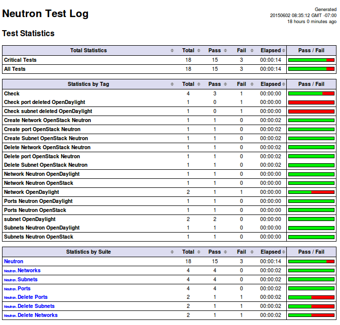

.. This work is licensed under a Creative Commons Attribution 4.0 International Licence.
.. http://creativecommons.org/licenses/by/4.0

Detailed test results for compass-os-odl_l2-nofeature-ha
========================================================

.. Add any text in here that could be useful for a reader.

The following section outlines the detailed functest results for the Brahmaputra scenario
deploying OpenStack with an OpenDaylight based ML2 SDN controller in a Pharos environment
by the Compass installer.

VIM
---

vPing_SSH
^^^^^^^^^

vPing test case output is displayed in the console::

  FUNCTEST.info: Running vPing test...
  2016-01-23 03:18:20,153 - vPing- INFO - Creating neutron network vping-net...
  2016-01-23 03:18:35,476 - vPing- INFO - Flavor found 'm1.small'
  2016-01-23 03:18:36,350 - vPing- INFO - vPing Start Time:'2016-01-23 03:18:36'
  2016-01-23 03:18:38,571 - vPing- INFO - Creating instance 'opnfv-vping-1' with IP 192.168.130.30...
  2016-01-23 03:18:53,716 - vPing- INFO - Instance 'opnfv-vping-1' is ACTIVE.
  2016-01-23 03:18:55,239 - vPing- INFO - Creating instance 'opnfv-vping-2' with IP 192.168.130.40...
  2016-01-23 03:19:15,593 - vPing- INFO - Instance 'opnfv-vping-2' is ACTIVE.
  2016-01-23 03:19:15,593 - vPing- INFO - Creating floating IP for the second VM...
  2016-01-23 03:19:18,017 - vPing- INFO - Floating IP created: '10.2.65.6'
  2016-01-23 03:19:18,017 - vPing- INFO - Associating floating ip: '10.2.65.6' to VM2
  2016-01-23 03:19:37,839 - vPing- INFO - SCP ping script to VM2...
  2016-01-23 03:19:37,839 - vPing- INFO - Waiting for ping...
  2016-01-23 03:19:40,130 - vPing- INFO - vPing detected!
  2016-01-23 03:19:40,130 - vPing- INFO - vPing duration:'63.8'
  2016-01-23 03:19:40,130 - vPing- INFO - Cleaning up...
  2016-01-23 03:20:06,574 - vPing- INFO - Deleting network 'vping-net'...
  2016-01-23 03:20:13,587 - vPing- INFO - vPing OK

vPing_userdata
^^^^^^^^^^^^^^

vPing_userdata results are displayed in the console::

    2016-01-06 16:06:20,550 - vPing- INFO - Creating neutron network vping-net...
    2016-01-06 16:06:23,867 - vPing- INFO - Flavor found 'm1.small'
    2016-01-06 16:06:24,457 - vPing- INFO - vPing Start Time:'2016-01-06 16:06:24'
    2016-01-06 16:06:24,626 - vPing- INFO - Creating instance 'opnfv-vping-1' with IP 192.168.130.30...
    2016-01-06 16:06:39,351 - vPing- INFO - Instance 'opnfv-vping-1' is ACTIVE.
    2016-01-06 16:06:39,650 - vPing- INFO - Creating instance 'opnfv-vping-2' with IP 192.168.130.40...
    2016-01-06 16:06:53,330 - vPing- INFO - Instance 'opnfv-vping-2' is ACTIVE.
    2016-01-06 16:06:53,330 - vPing- INFO - Waiting for ping...
    2016-01-06 16:06:58,669 - vPing- INFO - vPing detected!
    2016-01-06 16:06:58,669 - vPing- INFO - vPing duration:'34.2'
    2016-01-06 16:06:58,670 - vPing- INFO - Cleaning up...
    2016-01-06 16:07:12,661 - vPing- INFO - Deleting network 'vping-net'...
    2016-01-06 16:07:14,748 - vPing- INFO - vPing OK

Tempest
^^^^^^^

The Tempest results are displayed in the console::

  FUNCTEST.info: Running Tempest tests...
  2016-01-28 07:56:55,380 - run_tempest - INFO - Creating tenant and user for Tempest suite
  2016-01-28 07:56:56.127 23795 INFO rally.verification.tempest.tempest [-] Starting: Creating configuration file for Tempest.
  2016-01-28 07:56:59.512 23795 INFO rally.verification.tempest.tempest [-] Completed: Creating configuration file for Tempest.
  16-01-28 07:57:00,597 - run_tempest - INFO - Starting Tempest test suite: '--tests-file /home/opnfv/repos/functest/testcases/VIM/OpenStack/CI/custom_tests/test_list.txt'.
  Total results of verification:
  .
  +--------------------------------------+--------------------------------------+----------+-------+----------+----------------------------+----------+
  | UUID                                 | Deployment UUID                      | Set name | Tests | Failures | Created at                 | Status   |
  +--------------------------------------+--------------------------------------+----------+-------+----------+----------------------------+----------+
  | e0bf7770-2c0f-4c63-913c-cd51a6edd96d | 16582e1e-7b01-4d5d-9c13-a26db8567b7b |          | 144   | 30       | 2016-01-28 07:57:01.044856 | finished |
  +--------------------------------------+--------------------------------------+----------+-------+----------+----------------------------+----------+
  .
  Tests:
  .
  +------------------------------------------------------------------------------------------------------------------------------------------+-----------+---------+
  | name                                                                                                                                     | time      | status  |
  +------------------------------------------------------------------------------------------------------------------------------------------+-----------+---------+
  | tempest.api.compute.flavors.test_flavors.FlavorsV2TestJSON.test_get_flavor                                                               | 0.29804   | success |
  | tempest.api.compute.flavors.test_flavors.FlavorsV2TestJSON.test_list_flavors                                                             | 0.06289   | success |
  | tempest.api.compute.images.test_images.ImagesTestJSON.test_delete_saving_image                                                           | 9.21756   | success |
  | tempest.api.compute.images.test_images_oneserver.ImagesOneServerTestJSON.test_create_delete_image                                        | 8.65376   | success |
  | tempest.api.compute.images.test_images_oneserver.ImagesOneServerTestJSON.test_create_image_specify_multibyte_character_image_name        | 9.10993   | success |
  | tempest.api.compute.images.test_list_image_filters.ListImageFiltersTestJSON.test_list_images_filter_by_changes_since                     | 0.19585   | success |
  ...........................................
  2016-01-28 08:19:32,132 - run_tempest - INFO - Results: {'timestart': '2016-01-2807:57:01.044856', 'duration': 1350, 'tests': 144, 'failures': 30}
  2016-01-28 08:19:32,133 - run_tempest - INFO - Pushing results to DB: 'http://testresults.opnfv.org/testapi/results'.
  2016-01-28 08:19:32,278 - run_tempest - INFO - Deleting tenant and user for Tempest suite)

In order to check all the available test cases related debug information, inspect
tempest.log file stored under */home/opnfv/functest/results/tempest/*.

Rally
^^^^^

The Rally results are displayed in the console, each module is run one after the
other. Tables are displayed::

  +-------------------------------------------------------------------------------------------+
  |                                   Response Times (sec)                                    |
  +----------------------+-------+--------+--------+--------+-------+-------+---------+-------+
  | action               | min   | median | 90%ile | 95%ile | max   | avg   | success | count |
  +----------------------+-------+--------+--------+--------+-------+-------+---------+-------+
  | keystone.create_role | 0.358 | 0.572  | 0.772  | 0.811  | 1.106 | 0.603 | 100.0%  | 20    |
  | keystone.add_role    | 0.32  | 0.436  | 0.846  | 0.903  | 1.018 | 0.51  | 100.0%  | 20    |
  | keystone.list_roles  | 0.102 | 0.185  | 0.253  | 0.275  | 0.347 | 0.188 | 100.0%  | 20    |
  | total                | 0.845 | 1.223  | 1.821  | 1.822  | 1.823 | 1.302 | 100.0%  | 20    |
  +----------------------+-------+--------+--------+--------+-------+-------+---------+-------+
  Load duration: 7.13633608818
  Full duration: 36.7863121033
  ..............
  +------------------------------------------------------------------------------------------+
  |                                   Response Times (sec)                                   |
  +---------------------+-------+--------+--------+--------+-------+-------+---------+-------+
  | action              | min   | median | 90%ile | 95%ile | max   | avg   | success | count |
  +---------------------+-------+--------+--------+--------+-------+-------+---------+-------+
  | nova.create_keypair | 1.005 | 1.784  | 3.025  | 3.636  | 4.373 | 2.004 | 100.0%  | 20    |
  | nova.delete_keypair | 0.199 | 0.699  | 1.007  | 1.244  | 3.014 | 0.79  | 100.0%  | 20    |
  | total               | 1.249 | 2.625  | 4.259  | 4.845  | 5.131 | 2.794 | 100.0%  | 20    |
  +---------------------+-------+--------+--------+--------+-------+-------+---------+-------+
  Load duration: 14.9231169224
  Full duration: 71.4614388943

At the end of the module test, a message is displayed to provide a global
summary::

  2016-02-04 12:50:18,382 - run_rally - INFO - Test scenario: "requests" OK.

Controllers
-----------

OpenDaylight
^^^^^^^^^^^^

The results of ODL tests can be seen in the console::

 ==============================================================================
 Basic
 ==============================================================================
 Basic.010 Restconf OK :: Test suite to verify Restconf is OK
 ==============================================================================
 Get Controller Modules :: Get the controller modules via Restconf     | PASS |
 ------------------------------------------------------------------------------
 Basic.010 Restconf OK :: Test suite to verify Restconf is OK          | PASS |
 1 critical test, 1 passed, 0 failed
 1 test total, 1 passed, 0 failed
 ==============================================================================
 Basic                                                                 | PASS |
 1 critical test, 1 passed, 0 failed
 1 test total, 1 passed, 0 failed
 ==============================================================================
 Output:  /home/opnfv/repos/functest/output.xml
 Log:     /home/opnfv/repos/functest/log.html
 Report:  /home/opnfv/repos/functest/report.html

 ..............................................................................

 Neutron.Delete Networks :: Checking Network deleted in OpenStack a... | PASS |
 2 critical tests, 2 passed, 0 failed
 2 tests total, 2 passed, 0 failed
 ==============================================================================
 Neutron :: Test suite for Neutron Plugin                              | PASS |
 18 critical tests, 18 passed, 0 failed
 18 tests total, 18 passed, 0 failed
 ==============================================================================
 Output:  /home/opnfv/repos/functest/output.xml
 Log:     /home/opnfv/repos/functest/log.html
 Report:  /home/opnfv/repos/functest/report.html

3 result files are generated:
 * output.xml
 * log.html
 * report.html

**ODL result page**

ONOS
^^^^

The ONOS test logs can be found in OnosSystemTest/, and TestON/, and logs/
(ONOSCI_PATH to be added), and can also be seen in the console::

 ******************************
 Result summary for Testcase4
 ******************************

 2016-01-14 05:25:40,529 - FUNCvirNetNBL3 - INFO - ONOS Router Delete test Start

 [2016-01-14 05:25:40.529644] [FUNCvirNetNBL3] [CASE]  Virtual Network NBI Test - Router
 2016-01-14 05:25:40,530 - FUNCvirNetNBL3 - INFO - Generate Post Data

 [2016-01-14 05:25:40.530825] [FUNCvirNetNBL3] [STEP]  4.1: Post Network Data via HTTP(Post Router need post network)
 2016-01-14 05:25:40,531 - FUNCvirNetNBL3 - INFO - Sending request http://192.168.122.56:8181/onos/vtn/networks/ using POST method.
 2016-01-14 05:25:40,539 - FUNCvirNetNBL3 - INFO - Verifying the Expected is equal to the actual or not using assert_equal
 2016-01-14 05:25:40,539 - FUNCvirNetNBL3 - INFO - Post Network Success
 2016-01-14 05:25:40,539 - FUNCvirNetNBL3 - INFO - Assertion Passed

 [2016-01-14 05:25:40.539687] [FUNCvirNetNBL3] [STEP]  4.2: Post Router Data via HTTP
 2016-01-14 05:25:40,540 - FUNCvirNetNBL3 - INFO - Sending request http://192.168.122.56:8181/onos/vtn/routers/ using POST method.
 2016-01-14 05:25:40,543 - FUNCvirNetNBL3 - INFO - Verifying the Expected is equal to the actual or not using assert_equal
 2016-01-14 05:25:40,543 - FUNCvirNetNBL3 - INFO - Post Router Success
 2016-01-14 05:25:40,543 - FUNCvirNetNBL3 - INFO - Assertion Passed

 [2016-01-14 05:25:40.543489] [FUNCvirNetNBL3] [STEP]  4.3: Delete Router Data via HTTP
 2016-01-14 05:25:40,543 - FUNCvirNetNBL3 - INFO - Sending request http://192.168.122.56:8181/onos/vtn/routers/e44bd655-e22c-4aeb-b1e9-ea1606875178 using DELETE method.
 2016-01-14 05:25:40,546 - FUNCvirNetNBL3 - INFO - Verifying the Expected is equal to the actual or not using assert_equal
 2016-01-14 05:25:40,546 - FUNCvirNetNBL3 - INFO - Delete Router Success
 2016-01-14 05:25:40,546 - FUNCvirNetNBL3 - INFO - Assertion Passed

 [2016-01-14 05:25:40.546774] [FUNCvirNetNBL3] [STEP]  4.4: Get Router Data is NULL
 2016-01-14 05:25:40,547 - FUNCvirNetNBL3 - INFO - Sending request http://192.168.122.56:8181/onos/vtn/routers/e44bd655-e22c-4aeb-b1e9-ea1606875178 using GET method.
 2016-01-14 05:25:40,550 - FUNCvirNetNBL3 - INFO - Verifying the Expected is equal to the actual or not using assert_equal
 2016-01-14 05:25:40,550 - FUNCvirNetNBL3 - INFO - Get Router Success
 2016-01-14 05:25:40,550 - FUNCvirNetNBL3 - INFO - Assertion Passed

 *****************************
  Result: Pass
 *****************************

 .......................................................................................

 ******************************
  Result summary for Testcase9
 ******************************
 .......................................................................................

 [2016-01-14 05:26:42.543489] [FUNCvirNetNBL3] [STEP]  9.6: FloatingIp Clean Data via HTTP
 2016-01-14 05:26:42,543 - FUNCvirNetNBL3 - INFO - Sending request http://192.168.122.56:8181/onos/vtn/floatingips/e44bd655-e22c-4aeb-b1e9-ea1606875178 using DELETE method.
 2016-01-14 05:26:42,546 - FUNCvirNetNBL3 - INFO - Verifying the Expected is equal to the actual or not using assert_equal
 2016-01-14 05:26:42,546 - FUNCvirNetNBL3 - ERROR - Delete Floatingip failed

 .......................................................................................

 *****************************
  Result: Failed
 *****************************

There is a result summary for each testcase, and a global summary for the whole test.
If any problem occurs during the test, a ERROR message will be provided in the test and the the global summary::

 *************************************
         Test Execution Summary
 *************************************

  Test Start           : 14 Jan 2016 05:25:37
  Test End             : 14 Jan 2016 05:25:41
  Execution Time       : 0:00:03.349087
  Total tests planned  : 11
  Total tests RUN      : 11
  Total Pass           : 8
  Total Fail           : 3
  Total No Result      : 0
  Success Percentage   : 72%
  Execution Result     : 100%

OpenContrail
^^^^^^^^^^^^

TODO OVNO

Feature
-------

vIMS
^^^^

The results in the console can be described as follows::

    FUNCTEST.info: Running vIMS test...
    2016-02-04 13:46:25,025 - vIMS - INFO - Prepare OpenStack plateform (create tenant and user)
    2016-02-04 13:46:25,312 - vIMS - INFO - Update OpenStack creds informations
    2016-02-04 13:46:25,312 - vIMS - INFO - Upload some OS images if it doesn't exist
    2016-02-04 13:46:25,566 - vIMS - INFO - centos_7 image doesn't exist on glance repository.
                                Try downloading this image and upload on glance !
    2016-02-04 13:47:06,167 - vIMS - INFO - ubuntu_14.04 image doesn't exist on glance repository.
                                Try downloading this image and upload on glance !
    2016-02-04 13:47:26,987 - vIMS - INFO - Update security group quota for this tenant
    2016-02-04 13:47:27,193 - vIMS - INFO - Update cinder quota for this tenant
    2016-02-04 13:47:27,746 - vIMS - INFO - Collect flavor id for cloudify manager server
    2016-02-04 13:47:28,326 - vIMS - INFO - Prepare virtualenv for cloudify-cli
    2016-02-04 13:48:00,657 - vIMS - INFO - Downloading the cloudify manager server blueprint
    2016-02-04 13:48:03,391 - vIMS - INFO - Cloudify deployment Start Time:'2016-02-04 13:48:03'
    2016-02-04 13:48:03,391 - vIMS - INFO - Writing the inputs file
    2016-02-04 13:48:03,395 - vIMS - INFO - Launching the cloudify-manager deployment
    2016-02-04 13:56:03,501 - vIMS - INFO - Cloudify-manager server is UP !
    2016-02-04 13:56:03,502 - vIMS - INFO - Cloudify deployment duration:'480.1'
    2016-02-04 13:56:03,502 - vIMS - INFO - Collect flavor id for all clearwater vm
    2016-02-04 13:56:04,093 - vIMS - INFO - vIMS VNF deployment Start Time:'2016-02-04 13:56:04'
    2016-02-04 13:56:04,093 - vIMS - INFO - Downloading the openstack-blueprint.yaml blueprint
    2016-02-04 13:56:06,265 - vIMS - INFO - Writing the inputs file
    2016-02-04 13:56:06,268 - vIMS - INFO - Launching the clearwater deployment
    2016-02-04 14:11:27,101 - vIMS - INFO - The deployment of clearwater-opnfv is ended
    2016-02-04 14:11:27,103 - vIMS - INFO - vIMS VNF deployment duration:'923.0'
    2016-02-04 14:14:31,976 - vIMS - INFO - vIMS functional test Start Time:'2016-02-04 14:14:31'
    2016-02-04 14:15:45,880 - vIMS - INFO - vIMS functional test duration:'73.9'
    2016-02-04 14:15:46,113 - vIMS - INFO - Launching the clearwater-opnfv undeployment
    2016-02-04 14:18:12,604 - vIMS - INFO - Launching the cloudify-manager undeployment
    2016-02-04 14:18:51,808 - vIMS - INFO - Cloudify-manager server has been successfully removed!
    2016-02-04 14:18:51,870 - vIMS - INFO - Removing vIMS tenant ..
    2016-02-04 14:18:52,131 - vIMS - INFO - Removing vIMS user ..

Please note that vIMS traces can bee summarized in several steps:

 * INFO: environment prepared successfully => environment OK
 * INFO - Cloudify-manager server is UP ! => orchestrator deployed
 * INFO - The deployment of clearwater-opnfv is ended => VNF deployed
 * Multiple Identities (UDP) - (6505550771, 6505550675) Passed => tests run

Promise
^^^^^^^

The results can be observed in the console::

    Running test case: promise
    ----------------------------------------------
    FUNCTEST.info: Running PROMISE test case...
    2016-02-04 07:10:37,735 - Promise- INFO - Creating tenant 'promise'...
    2016-02-04 07:10:37,893 - Promise- INFO - Adding role '59828986a9a94dfaa852548599fde628' to tenant 'promise'...
    2016-02-04 07:10:38,005 - Promise- INFO - Creating user 'promiser'...
    2016-02-04 07:10:38,128 - Promise- INFO - Updating OpenStack credentials...
    2016-02-04 07:10:38,157 - Promise- INFO - Creating image 'promise-img' from '/home/opnfv/functest/data/cirros-0.3.4-x86_64-disk.img'...
    2016-02-04 07:10:42,016 - Promise- INFO - Creating flavor 'promise-flavor'...
    2016-02-04 07:10:42,836 - Promise- INFO - Exporting environment variables...
    2016-02-04 07:10:42,836 - Promise- INFO - Running command: DEBUG=1 npm run -s test -- --reporter json
    2016-02-04 07:10:51,505 - Promise- INFO - The test succeeded.
    ....
    **********************************
        Promise test summary
    **********************************
    Test start: Thu Feb 04 07:10:42 UTC 2016
    Test end: Thu Feb 04 07:10:51 UTC 2016
    Execution time: 8.7
    Total tests executed: 33
    Total tests failed: 0
    **********************************

