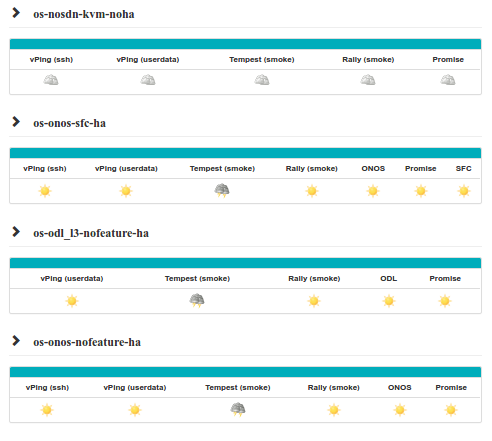

.. http://creativecommons.org/licenses/by/4.0

Test reporting
==============

An automatic reporting page has been created in order to provide a consistent
view of the Functest tests on the different scenarios.

In this page, each scenario is evaluated according to test criteria.

The results are collected from the centralized database every day and, per
scenario. A score is calculated based on the results from the last 10 days.
This score is the addition of single test scores. Each test case has a success
criteria reflected in the criteria field from the results.

As an illustration, let's consider the scenario
os-odl_l2-nofeature-ha scenario, the scenario scoring is the addition of the
scores of all the runnable tests from the categories (tiers, healthcheck, smoke
and features) corresponding to this scenario.

   +---------------------+---------+---------+---------+---------+
   | Test                | Apex    | Compass | Fuel    |  Joid   |
   +=====================+=========+=========+=========+=========+
   | vPing_ssh           |    X    |    X    |    X    |    X    |
   +---------------------+---------+---------+---------+---------+
   | vPing_userdata      |    X    |    X    |    X    |    X    |
   +---------------------+---------+---------+---------+---------+
   | tempest_smoke       |    X    |    X    |    X    |    X    |
   +---------------------+---------+---------+---------+---------+
   | rally_sanity        |    X    |    X    |    X    |    X    |
   +---------------------+---------+---------+---------+---------+
   | odl                 |    X    |    X    |    X    |    X    |
   +---------------------+---------+---------+---------+---------+
   | promise             |         |         |    X    |    X    |
   +---------------------+---------+---------+---------+---------+
   | doctor              |    X    |         |    X    |         |
   +---------------------+---------+---------+---------+---------+
   | security_scan       |    X    |         |         |         |
   +---------------------+---------+---------+---------+---------+
   | parser              |         |         |    X    |         |
   +---------------------+---------+---------+---------+---------+
   | copper              |    X    |         |         |    X    |
   +---------------------+---------+---------+---------+---------+

   src:  os-odl_l2-nofeature-ha Colorado (see release note for the last matrix
   version)

All the testcases (X) listed in the table are runnable on os-odl_l2-nofeature
scenarios.
Please note that other test cases (e.g. sfc_odl, bgpvpn) need ODL configuration
addons and, as a consequence, specific scenario.
There are not considered as runnable on the generic odl_l2 scenario.

If no result is available or if all the results are failed, the test case get 0
point.
If it was successful at least once but not anymore during the 4 runs, the case
get 1 point (it worked once).
If at least 3 of the last 4 runs were successful, the case get 2 points.
If the last 4 runs of the test are successful, the test get 3 points.

In the example above, the target score for fuel/os-odl_l2-nofeature-ha is
3 x 8 = 24 points and for compass it is 3 x 5 = 15 points .

The scenario is validated per installer when we got 3 points for all individual
test cases (e.g 24/24 for fuel, 15/15 for compass).

Please note that complex or long duration tests are not considered yet for the
scoring. In fact the success criteria are not always easy to define and may
require specific hardware configuration.

Please also note that all the test cases have the same "weight" for the score
calculation whatever the complexity of the test case. Concretely a vping has
the same weight than the 200 tempest tests.
Moreover some installers support more features than others. The more cases your
scenario is dealing with, the most difficult to rich a good scoring.

Therefore the scoring provides 3 types of indicators:

  * the richness of the scenario: if the target scoring is high, it means that
    the scenario includes lots of features
  * the maturity: if the percentage (scoring/target scoring * 100) is high, it
    means that all the tests are PASS
  * the stability: as the number of iteration is included in the calculation,
    the pecentage can be high only if the scenario is run regularly (at least
    more than 4 iterations over the last 10 days in CI)

In any case, the scoring is used to give feedback to the other projects and
does not represent an absolute value of the scenario.

See `reporting page`_ for details. For the status, click on the version,
Functest then the Status menu.

.. _`reporting page`: http://testresults.opnfv.org/reporting/

