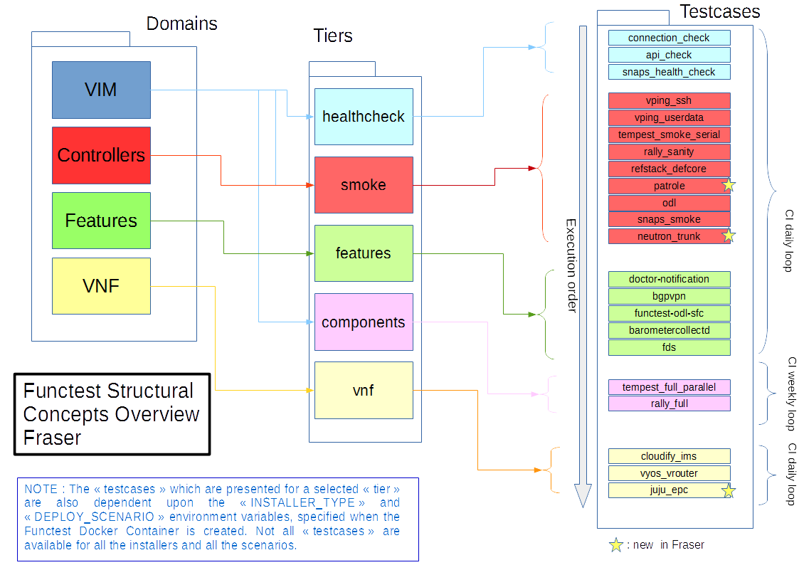
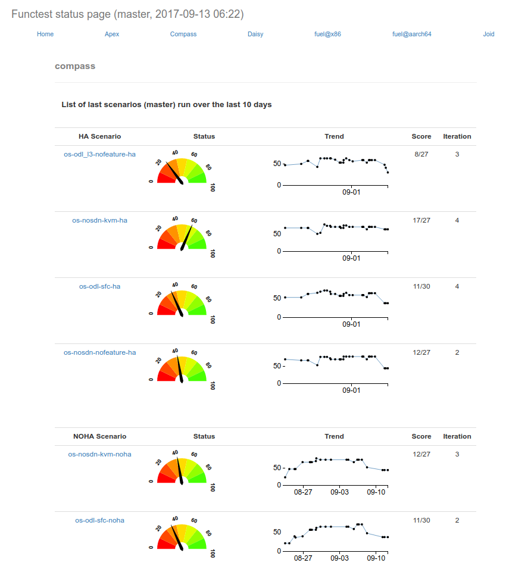

.. SPDX-License-Identifier: CC-BY-4.0

Overview of the Functest suites
===============================

Functest is the OPNFV project primarily targeting functional testing.
In the Continuous Integration pipeline, it is launched after an OPNFV fresh
installation to validate and verify the basic functions of the
infrastructure.

The current list of test suites can be distributed over 5 main domains:
  * VIM (Virtualised Infrastructure Manager)
  * Controllers (i.e. SDN Controllers)
  * VNF (Virtual Network Functions)
  * Kubernetes

Functest test suites are also distributed in the OPNFV testing categories:
healthcheck, smoke, benchmarking, VNF, Stress tests.

All the Healthcheck and smoke tests of a given scenario must be successful to
validate the scenario for the release.

+-------------+---------------+------------+----------------------------------+
| Domain      | Tier          | Test case  | Comments                         |
+=============+===============+============+==================================+
| VIM         | healthcheck   | connection | Check OpenStack connectivity     |
|             |               | \_check    |                                  |
|             +---------------+------------+----------------------------------+
|             | smoke         | vping_ssh  | NFV "Hello World" using an SSH   |
|             |               |            | connection to a destination VM   |
|             |               |            | over a created floating IP       |
|             |               |            | address on the SUT Public /      |
|             |               |            | External network. Using the SSH  |
|             |               |            | connection a test script is then |
|             |               |            | copied to the destination        |
|             |               |            | VM and then executed via SSH.    |
|             |               |            | The script will ping another     |
|             |               |            | VM on a specified IP address over|
|             |               |            | the SUT Private Tenant network   |
|             |               +------------+----------------------------------+
|             |               | vping      | Uses Ping with given userdata    |
|             |               | \_userdata | to test intra-VM connectivity    |
|             |               |            | over the SUT Private Tenant      |
|             |               |            | network. The correct operation   |
|             |               |            | of the NOVA Metadata service is  |
|             |               |            | also verified in this test       |
|             |               +------------+----------------------------------+
|             |               | tempest    | Generate and run a relevant      |
|             |               | \_smoke    | Tempest Test Suite in smoke mode.|
|             |               |            | The generated test set is        |
|             |               |            | dependent on the OpenStack       |
|             |               |            | deployment environment           |
|             |               +------------+----------------------------------+
|             |               | rally      | Run a subset of the OpenStack    |
|             |               | \_sanity   | Rally Test Suite in smoke mode   |
|             |               +------------+----------------------------------+
|             |               | refstack   | Reference RefStack suite         |
|             |               | \_defcore  | tempest selection for NFV        |
|             |               +------------+----------------------------------+
|             |               | patrole    | Patrole is a tempest plugin for  |
|             |               |            | testing and verifying RBAC policy|
|             |               |            | enforcement, which offers testing|
|             |               |            | for the following OpenStack      |
|             |               |            | services: Nova, Neutron, Glance, |
|             |               |            | Cinder and Keystone              |
|             +---------------+------------+----------------------------------+
|             |               | neutron    | The neutron trunk port testcases |
|             |               | \_trunk    | have been introduced and they are|
|             |               |            | supported by installers :        |
|             |               |            | Apex, Fuel and Compass.          |
|             +---------------+------------+----------------------------------+
|             | components    | tempest    | Generate and run a full set of   |
|             |               | \_full     | the OpenStack Tempest Test Suite.|
|             |               | \_parallel | See the OpenStack reference test |
|             |               |            | suite `[2]`_. The generated      |
|             |               |            | test set is dependent on the     |
|             |               |            | OpenStack deployment environment |
|             |               +------------+----------------------------------+
|             |               | rally_full | Run the OpenStack testing tool   |
|             |               |            | benchmarking OpenStack modules   |
|             |               |            | See the Rally documents `[3]`_   |
+-------------+---------------+------------+----------------------------------+
| VNF         | vnf           | cloudify   | Example of a real VNF deployment |
|             |               | \_ims      | to show the NFV capabilities of  |
|             |               |            | the platform. The IP Multimedia  |
|             |               |            | Subsystem is a typical Telco test|
|             |               |            | case, referenced by ETSI.        |
|             |               |            | It provides a fully functional   |
|             |               |            | VoIP System                      |
|             |               +------------+----------------------------------+
|             |               | vyos       | vRouter testing                  |
|             |               | \_vrouter  |                                  |
+-------------+---------------+------------+----------------------------------+
| Kubernetes  | healthcheck   | k8s_smoke  | Test a running Kubernetes        |
|             |               |            | cluster and ensure it satisfies  |
|             |               |            | minimal functional requirements  |
|             +---------------+------------+----------------------------------+
|             | smoke         | k8s\_      | Run a subset of Kubernetes       |
|             |               | conformance| End-to-End tests, expected to    |
|             |               |            | pass on any Kubernetes cluster   |
+-------------+---------------+------------+----------------------------------+

As shown in the above table, Functest is structured into different 'domains',
'tiers' and 'test cases'. Each 'test case' usually represents an actual
'Test Suite' comprised -in turn- of several test cases internally.

Test cases also have an implicit execution order. For example, if the early
'healthcheck' Tier testcase fails, or if there are any failures in the 'smoke'
Tier testcases, there is little point to launch a full testcase execution
round.

In Danube, we merged smoke and sdn controller tiers in smoke tier.

An overview of the Functest Structural Concept is depicted graphically below:

Some of the test cases are developed by Functest team members, whereas others
are integrated from upstream communities or other OPNFV projects. For example,
`Tempest <https://docs.openstack.org/tempest/latest/>`_ is the
OpenStack integration test suite and Functest is in charge of the selection,
integration and automation of those tests that fit suitably to OPNFV.

The Tempest test suite is the default OpenStack smoke test suite but no new
test cases have been created in OPNFV Functest.

The results produced by the tests run from CI are pushed and collected into a
NoSQL database. The goal is to populate the database with results from
different sources and scenarios and to show them on a `Functest Dashboard`_. A
screenshot of a live Functest Dashboard is shown below:

Basic components (VIM, SDN controllers) are tested through their own suites.
Feature projects also provide their own test suites with different ways of
running their tests.

The notion of domain has been introduced in the description of the test cases
stored in the Database.
This parameters as well as possible tags can be used for the Test case catalog.

vIMS test case was integrated to demonstrate the capability to deploy a
relatively complex NFV scenario on top of the OPNFV infrastructure.

Functest considers OPNFV as a black box. OPNFV offers a lot of potential
combinations (which may change from one version to another):

  * 3 controllers (OpenDaylight, ONOS, OpenContrail)
  * 5 installers (Apex, Compass, Daisy, Fuel, Joid)

Most of the tests are runnable by any combination, but some tests might have
restrictions imposed by the utilized installers or due to the available
deployed services. The system uses the environment variables to automatically
determine the valid test cases, for each given environment.

A convenience Functest CLI utility is also available to simplify setting up the
Functest environment, management of the OpenStack environment (e.g. resource
clean-up) and for executing tests.
The Functest CLI organised the testcase into logical Tiers, which contain in
turn one or more testcases. The CLI allows execution of a single specified
testcase, all test cases in a specified Tier, or the special case of execution
of **ALL** testcases. The Functest CLI is introduced in more details in next
section.

.. _`[2]`: https://docs.openstack.org/tempest/latest/
.. _`[3]`: https://rally.readthedocs.io/en/latest/index.html
.. _`Functest Dashboard`: http://testresults.opnfv.org/
