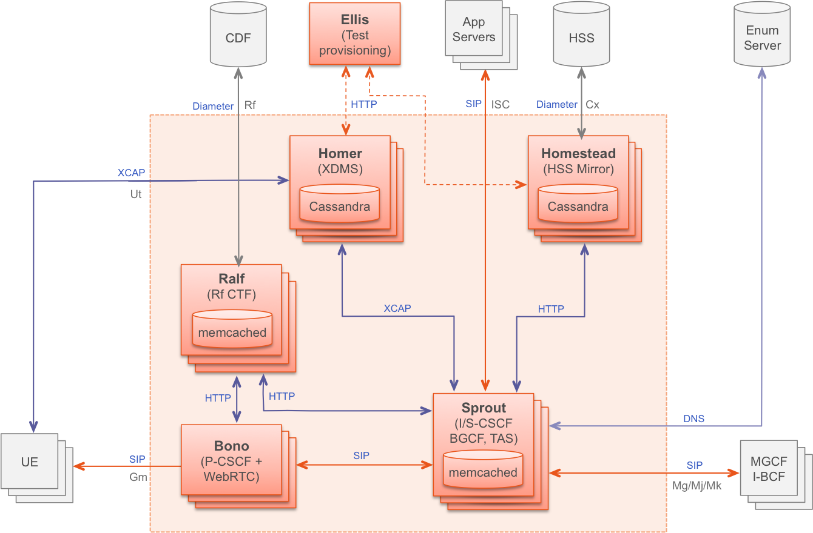

.. This work is licensed under a Creative Commons Attribution 4.0 International License.
.. http://creativecommons.org/licenses/by/4.0

=========================
OPNFV FUNCTEST user guide
=========================

.. toctree::
   :maxdepth: 2

Introduction
============

The goal of this document is to describe the OPNFV Functest test cases and to
provide a procedure to execute them. In the OPNFV Colorado system release,
a Functest CLI utility is introduced for easier execution of test procedures.

A overview presentation has been created for the first OPNFV Summit `[4]`_.

This document is a continuation of the OPNFV Functest Configuration Guide `[1]`_.

**IMPORTANT**: It is assumed here that the Functest Docker container is already
properly deployed and that all instructions described in this guide are to be
performed from *inside* the deployed Functest Docker container.

.. include:: ./introduction.rst

The different test cases are described in the remaining sections of this document.

VIM (Virtualized Infrastructure Manager)
----------------------------------------

Healthcheck
^^^^^^^^^^^
In Colorado release a new Tier 'healthcheck' with one testcase 'healthcheck'
is introduced. The healthcheck testcase verifies that some basic IP connectivity
and  essential operations of OpenStack functionality over the command line are
working correctly.

In particular, the following verifications are performed:

  * DHCP agent functionality for IP address allocation
  * Openstack Authentication management functionality via the Keystone API
  * OpenStack Image management functionality via the Glance API
  * OpenStack Block Storage management functionality via the Cinder API
  * OpenStack Networking management functionality via the Neutron API
  * Openstack Compute management functionality via the NOVA API

Self-obviously, successful completion of the 'healthcheck' testcase is a
necessary pre-requisite for the execution of all other test Tiers.

vPing_ssh
^^^^^^^^^

Given the script **ping.sh**::

    #!/bin/sh
    while true; do
        ping -c 1 $1 2>&1 >/dev/null
        RES=$?
        if [ "Z$RES" = "Z0" ] ; then
            echo 'vPing OK'
            break
        else
            echo 'vPing KO'
        fi
    sleep 1
    done

The goal of this test is to establish an SSH connection using a floating IP
on the Public/External network and verify that 2 instances can talk over a Private
Tenant network::

 vPing_ssh test case
 +-------------+                    +-------------+
 |             |                    |             |
 |             | Boot VM1 with IP1  |             |
 |             +------------------->|             |
 |   Tester    |                    |   System    |
 |             | Boot VM2           |    Under    |
 |             +------------------->|     Test    |
 |             |                    |             |
 |             | Create floating IP |             |
 |             +------------------->|             |
 |             |                    |             |
 |             | Assign floating IP |             |
 |             | to VM2             |             |
 |             +------------------->|             |
 |             |                    |             |
 |             | Stablish SSH       |             |
 |             | connection to VM2  |             |
 |             | through floating IP|             |
 |             +------------------->|             |
 |             |                    |             |
 |             | SCP ping.sh to VM2 |             |
 |             +------------------->|             |
 |             |                    |             |
 |             | VM2 executes       |             |
 |             | ping.sh to VM1     |             |
 |             +------------------->|             |
 |             |                    |             |
 |             |    If ping:        |             |
 |             |      exit OK       |             |
 |             |    else (timeout): |             |
 |             |      exit Failed   |             |
 |             |                    |             |
 +-------------+                    +-------------+

This test can be considered as an "Hello World" example.
It is the first basic use case which **must** work on any deployment.

vPing_userdata
^^^^^^^^^^^^^^

This test case is similar to vPing_ssh but without the use of Floating IPs
and the Public/External network to transfer the ping script.
Instead, it uses Nova metadata service to pass it to the instance at booting time.
As vPing_ssh, it checks that 2 instances can talk to
each other on a Private Tenant network::

 vPing_userdata test case
 +-------------+                    +-------------+
 |             |                    |             |
 |             | Boot VM1 with IP1  |             |
 |             +------------------->|             |
 |             |                    |             |
 |             | Boot VM2 with      |             |
 |             | ping.sh as userdata|             |
 |             | with IP1 as $1.    |             |
 |             +------------------->|             |
 |   Tester    |                    |   System    |
 |             | VM2 exeutes ping.sh|    Under    |
 |             | (ping IP1)         |     Test    |
 |             +------------------->|             |
 |             |                    |             |
 |             | Monitor nova       |             |
 |             |  console-log VM 2  |             |
 |             |    If ping:        |             |
 |             |      exit OK       |             |
 |             |    else (timeout)  |             |
 |             |      exit Failed   |             |
 |             |                    |             |
 +-------------+                    +-------------+

When the second VM boots it will execute the script passed as userdata
automatically. The ping will be detected by periodically capturing the output
in the console-log of the second VM.

Tempest
^^^^^^^

Tempest `[2]`_ is the reference OpenStack Integration test suite.
It is a set of integration tests to be run against a live OpenStack cluster.
Tempest has suites of tests for:

  * OpenStack API validation
  * Scenarios
  * Other specific tests useful in validating an OpenStack deployment

Functest uses Rally `[3]`_ to run the Tempest suite.
Rally generates automatically the Tempest configuration file **tempest.conf**.
Before running the actual test cases,
Functest creates the needed resources (user, tenant) and
updates the appropriate parameters into the configuration file.

When the Tempest suite is executed, each test duration is measured and the full
console output is stored to a *log* file for further analysis.

The Tempest testcases are distributed accross two
Tiers:

  * Smoke Tier - Test Case 'tempest_smoke_serial'
  * Openstack Tier - Test case 'tempest_full_parallel'

NOTE: Test case 'tempest_smoke_serial' executes a defined set of tempest smoke
tests with a single thread (i.e. serial mode). Test case 'tempest_full_parallel'
executes all defined Tempest tests using several concurrent threads
(i.e. parallel mode). The number of threads activated corresponds to the number
of available logical CPUs.

The goal of the Tempest test suite is to check the basic functionalities of the
different OpenStack components on an OPNFV fresh installation, using the
corresponding REST API interfaces.

Rally bench test suites
^^^^^^^^^^^^^^^^^^^^^^^

Rally `[3]`_ is a benchmarking tool that answers the question:

*How does OpenStack work at scale?*

The goal of this test suite is to benchmark all the different OpenStack modules and
get significant figures that could help to define Telco Cloud KPIs.

The OPNFV Rally scenarios are based on the collection of the actual Rally scenarios:

 * authenticate
 * cinder
 * glance
 * heat
 * keystone
 * neutron
 * nova
 * quotas
 * requests

A basic SLA (stop test on errors) has been implemented.

The Rally testcases are distributed accross two Tiers:

  * Smoke Tier - Test Case 'rally_sanity'
  * Openstack Tier - Test case 'rally_full'

NOTE: Test case 'rally_sanity' executes a limited number of Rally smoke test
cases. Test case 'rally_full' executes the full defined set of Rally tests.

SDN Controllers
---------------

There are currently 2 available controllers:

 * OpenDaylight (ODL)
 * ONOS

OpenDaylight
^^^^^^^^^^^^

The OpenDaylight (ODL) test suite consists of a set of basic tests inherited
from the ODL project using the Robot `[11]`_ framework.
The suite verifies creation and deletion of networks, subnets and ports with
OpenDaylight and Neutron.

The list of tests can be described as follows:

 * Restconf.basic: Get the controller modules via Restconf
 * Neutron.Networks

   * Check OpenStack Networks :: Checking OpenStack Neutron for known networks
   * Check OpenDaylight Networks :: Checking OpenDaylight Neutron API
   * Create Network :: Create new network in OpenStack
   * Check Network :: Check Network created in OpenDaylight
   * Neutron.Networks :: Checking Network created in OpenStack are pushed

 * Neutron.Subnets

   * Check OpenStack Subnets :: Checking OpenStack Neutron for known Subnets
   * Check OpenDaylight subnets :: Checking OpenDaylight Neutron API
   * Create New subnet :: Create new subnet in OpenStack
   * Check New subnet :: Check new subnet created in OpenDaylight
   * Neutron.Subnets :: Checking Subnets created in OpenStack are pushed

 * Neutron.Ports

   * Check OpenStack ports :: Checking OpenStack Neutron for known ports
   * Check OpenDaylight ports :: Checking OpenDaylight Neutron API
   * Create New Port :: Create new port in OpenStack
   * Check New Port :: Check new subnet created in OpenDaylight
   * Neutron.Ports :: Checking Port created in OpenStack are pushed

 * Delete Ports

   * Delete previously created subnet in OpenStack
   * Check subnet deleted in OpenDaylight
   * Check subnet deleted in OpenStack

 * Delete network

   * Delete previously created network in OpenStack
   * Check network deleted in OpenDaylight
   * Check network deleted in OpenStack

ONOS
^^^^

TestON Framework is used to test the ONOS SDN controller functions.
The test cases deal with L2 and L3 functions.
The ONOS test suite can be run on any ONOS compliant scenario.

The test cases are described as follows:

 * onosfunctest: The main executable file contains the initialization of
   the docker environment and functions called by FUNCvirNetNB and
   FUNCvirNetNBL3

 * FUNCvirNetNB

   * Create Network: Post Network data and check it in ONOS
   * Update Network: Update the Network and compare it in ONOS
   * Delete Network: Delete the Network and check if it's NULL in ONOS or
     not
   * Create Subnet: Post Subnet data and check it in ONOS
   * Update Subnet: Update the Subnet and compare it in ONOS
   * Delete Subnet: Delete the Subnet and check if it's NULL in ONOS or not
   * Create Port: Post Port data and check it in ONOS
   * Update Port: Update the Port and compare it in ONOS
   * Delete Port: Delete the Port and check if it's NULL in ONOS or not

 * FUNCvirNetNBL3

   * Create Router: Post data for create Router and check it in ONOS
   * Update Router: Update the Router and compare it in ONOS
   * Delete Router: Delete the Router data and check it in ONOS
   * Create RouterInterface: Post Router Interface data to an existing Router
     and check it in ONOS
   * Delete RouterInterface: Delete the RouterInterface and check the Router
   * Create FloatingIp: Post data for create FloatingIp and check it in ONOS
   * Update FloatingIp: Update the FloatingIp and compare it in ONOS
   * Delete FloatingIp: Delete the FloatingIp and check that it is 'NULL' in
     ONOS
   * Create External Gateway: Post data to create an External Gateway for an
     existing Router and check it in ONOS
   * Update External Gateway: Update the External Gateway and compare the change
   * Delete External Gateway: Delete the External Gateway and check that it is
     'NULL' in ONOS

Open Contrail
^^^^^^^^^^^^^
**TODO:**

Features
--------

Doctor
^^^^^^

**TODO:**

Promise
^^^^^^^

Promise provides a basic set of test cases as part of the deliverable.

The available 33 test cases can be grouped into 7 test suites:

    #. Add a new OpenStack provider into resource pool: Registers
       OpenStack into a new resource pool and adds more capacity associated
       with this pool.

    #. Allocation without reservation: Creates a new server in OpenStack
       and adds a new allocation record in Promise shim-layer.

    #. Allocation using reservation for immediate use: Creates a resource
       reservation record with no start/end time and immediately creates a new
       server in OpenStack and add a new allocation record in Promise
       shim-layer.

    #. Reservation for future use: Creates a resource reservation record
       for a future start time, queries, modifies and cancels the newly created
       reservation.

    #. Capacity planning: Decreases and increases the available capacity
       from a provider in the future and queries the available collections and
       utilizations.

    #. Reservation with conflict: Tries to create reservations for
       immediate and future use with conflict.

    #. Cleanup test allocations: Destroys all allocations in OpenStack.

bgpvpn
^^^^^^
Many telecom network functions are relying on layer-3 infrastructure services,
within a VNF between components, or towards existing external networks.
In many cases, these external networks are implemented in MPLS/BGP technology in
existing service provider wide-area-networks (WAN). This proven technology
provides a good mechanism for inter-operation of a NFV Infrastructure (NFVI)
and WAN.

The SDNVPN project defined a 'bgpvpn' test suite.
This 'bgpvpn' test suite deals with 2 Tempest cases dedicated to the test of
the OpenStack 'bgpvpn' API:

  * test_create_bgpvpn
  * test_create_bgpvpn_as_non_admin_fail

security_scan
^^^^^^^^^^^^^

Security Scanning, is a project to insure security compliance and vulnerability
checks, as part of an automated CI / CD platform delivery process.

The project makes use of the existing SCAP format[6] to perform deep scanning of
NFVi nodes, to insure they are hardened and free of known CVE reported vulnerabilities.

The SCAP content itself, is then consumed and run using an upstream opensource tool
known as OpenSCAP[7].

The OPNFV Security Group have developed the code that will called by the OPNFV Jenkins
build platform, to perform a complete scan. Resulting reports are then copied to the
OPNFV functest dashboard.

The current work flow is as follows:

  * Jenkins Build Initiated
  * security_scan.py script is called, and a config file is passed to the script as
    an argument.
  * The IP addresses of each NFVi node (compute / control), is gathered.
  * A scan profile is matched to the node type.
  * The OpenSCAP application is remotely installed onto each target node gathered
    on step 3, using upstream packaging (rpm and .deb).
  * A scan is made against each node gathered within step 3.
  * HTML Reports are downloaded for rendering on a dashboard.
  * If the config file value 'clean' is set to 'True' then the application installed in
    step 5 is removed, and all reports created at step 6 are deleted.

At present, only the Apex installer is supported, with support for other installers due
within D-release.

VNF
---

vIMS
^^^^
The IP Multimedia Subsystem or IP Multimedia Core Network Subsystem (IMS) is an
architectural framework for delivering IP multimedia services.

vIMS has been integrated in Functest to demonstrate the capability to deploy a
relatively complex NFV scenario on the OPNFV platform. The deployment of a complete
functional VNF allows the test of most of the
essential functions needed for a NFV platform.

The goal of this test suite consists of:

 * deploy a VNF orchestrator (Cloudify)
 * deploy a Clearwater vIMS (IP Multimedia Subsystem) VNF from this
   orchestrator based on a TOSCA blueprint defined in `[5]`_
 * run suite of signaling tests on top of this VNF

The Clearwater architecture is described as follows:

.. include:: ./runfunctest.rst

Test results
============

Note that the results are documented per scenario basis. Although most of the test
cases might show the same output, some of them are not supported by
certain scenarios. Please select the appropriate scenario and compare the results
to that referenced in the documentation.

Test Dashboard
==============

Based on results collected in CI, a test dashboard is dynamically generated.

.. include:: ./troubleshooting.rst

References
==========

.. _`[1]`: http://artifacts.opnfv.org/functest/docs/configguide/#
.. _`[2]`: http://docs.openstack.org/developer/tempest/overview.html
.. _`[3]`: https://rally.readthedocs.org/en/latest/index.html
.. _`[4]`: http://events.linuxfoundation.org/sites/events/files/slides/Functest%20in%20Depth_0.pdf
.. _`[5]`: https://github.com/Orange-OpenSource/opnfv-cloudify-clearwater/blob/master/openstack-blueprint.yaml
.. _`[6]`: https://scap.nist.gov/
.. _`[7]`: https://github.com/OpenSCAP/openscap
.. _`[9]`: https://git.opnfv.org/cgit/functest/tree/testcases/VIM/OpenStack/CI/libraries/os_defaults.yaml
.. _`[11]`: http://robotframework.org/

OPNFV main site: opnfvmain_.

OPNFV functional test page: opnfvfunctest_.

IRC support chan: #opnfv-testperf

.. _opnfvmain: http://www.opnfv.org
.. _opnfvfunctest: https://wiki.opnfv.org/opnfv_functional_testing
.. _`OpenRC`: http://docs.openstack.org/user-guide/common/cli_set_environment_variables_using_openstack_rc.html
.. _`Rally installation procedure`: https://rally.readthedocs.org/en/latest/tutorial/step_0_installation.html
.. _`config_test.py` : https://git.opnfv.org/cgit/functest/tree/testcases/config_functest.py
.. _`config_functest.yaml` : https://git.opnfv.org/cgit/functest/tree/testcases/config_functest.yaml
