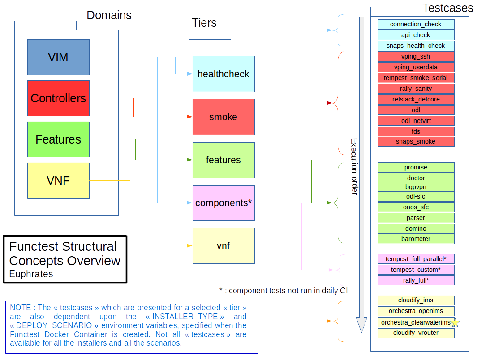
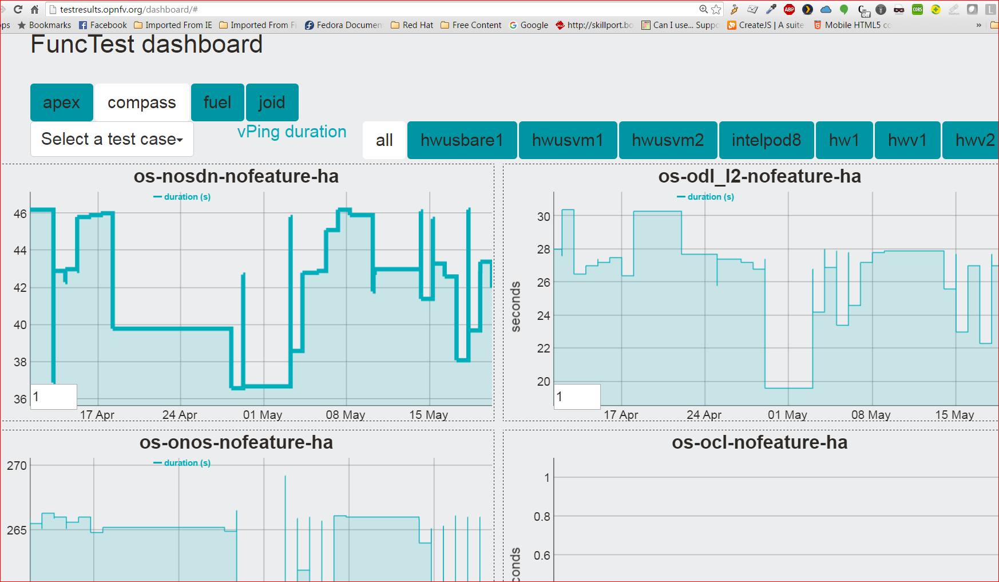

.. This work is licensed under a Creative Commons Attribution 4.0 International License.
.. http://creativecommons.org/licenses/by/4.0

Overview of the Functest suites
===============================

Functest is the OPNFV project primarily targeting function testing.
In the Continuous Integration pipeline, it is launched after an OPNFV fresh
installation to validate and verify the basic functions of the
infrastructure.

The current list of test suites can be distributed over 4 main domains: VIM
(Virtualised Infrastructure Manager), Controllers (i.e. SDN Controllers),
Features and VNF (Virtual Network Functions).

+-------------+---------------+----------------+----------------------------------+
| Domain      | Tier          | Test case      | Comments                         |
+=============+===============+================+==================================+
| VIM         | healthcheck   | healthcheck    | Verify basic operation in VIM    |
|             +---------------+----------------+----------------------------------+
|             | smoke         | vPing_SSH      | NFV "Hello World" using an SSH   |
|             |               |                | connection to a destination VM   |
|             |               |                | over a created floating IP       |
|             |               |                | address on the SUT Public /      |
|             |               |                | External network. Using the SSH  |
|             |               |                | connection a test script is then |
|             |               |                | copied to the destination        |
|             |               |                | VM and then executed via SSH.    |
|             |               |                | The script will ping another     |
|             |               |                | VM on a specified IP address over|
|             |               |                | the SUT Private Tenant network.  |
|             |               +----------------+----------------------------------+
|             |               | vPing_userdata | Uses Ping with given userdata    |
|             |               |                | to test intra-VM connectivity    |
|             |               |                | over the SUT Private Tenant      |
|             |               |                | network. The correct operation   |
|             |               |                | of the NOVA Metadata service is  |
|             |               |                | also verified in this test.      |
|             |               +----------------+----------------------------------+
|             |               | tempest_smoke  | Generate and run a relevant      |
|             |               | \_serial       | Tempest Test Suite in smoke mode.|
|             |               |                | The generated test set is        |
|             |               |                | dependent on the OpenStack       |
|             |               |                | deployment environment.          |
|             |               +----------------+----------------------------------+
|             |               | rally_sanity   | Run a subset of the OpenStack    |
|             |               |                | Rally Test Suite in smoke mode   |
|             +---------------+----------------+----------------------------------+
|             | openstack     | tempest_full   | Generate and run a full set of   |
|             |               | \_parallel     | the OpenStack Tempest Test Suite.|
|             |               |                | See the OpenStack reference test |
|             |               |                | suite `[2]`_. The generated      |
|             |               |                | test set is dependent on the     |
|             |               |                | OpenStack deployment environment.|
|             |               +----------------+----------------------------------+
|             |               | rally_full     | Run the OpenStack testing tool   |
|             |               |                | benchmarking OpenStack modules   |
|             |               |                | See the Rally documents `[3]`_.  |
+-------------+---------------+----------------+----------------------------------+
| Controllers | sdn_suites    | odl            | Opendaylight Test suite          |
|             |               |                | TODO: Find a document reference! |
|             |               +----------------+----------------------------------+
|             |               | onos           | Test suite of ONOS L2 and L3     |
|             |               |                | functions.                       |
|             |               |                | See `ONOSFW User Guide`_  for    |
|             |               |                | details.                         |
+-------------+---------------+----------------+----------------------------------+
| Features    | features      | Promise        | Resource reservation and         |
|             |               |                | management project to identify   |
|             |               |                | NFV related requirements and     |
|             |               |                | realize resource reservation for |
|             |               |                | future usage by capacity         |
|             |               |                | management of resource pools     |
|             |               |                | regarding compute, network and   |
|             |               |                | storage.                         |
|             |               |                | See `Promise User Guide`_ for    |
|             |               |                | details.                         |
|             |               +----------------+----------------------------------+
|             |               | Doctor         | Doctor platform, as of Colorado  |
|             |               |                | release, provides the two        |
|             |               |                | features:                        |
|             |               |                | * Immediate Notification         |
|             |               |                | * Consistent resource state      |
|             |               |                | awareness (compute). See the     |
|             |               |                | See `Doctor User Guide`_ for     |
|             |               |                | details                          |
|             |               +----------------+----------------------------------+
|             |               | bgpvpn         | Implementation of the OpenStack  |
|             |               |                | bgpvpn API from the SDNVPN       |
|             |               |                | feature project. It allows for   |
|             |               |                | the creation of BGP VPNs.        |
|             |               |                | See `SDNVPN User Guide`_ for     |
|             |               |                | details                          |
|             |               +----------------+----------------------------------+
|             |               | security_scan  | Implementation of a simple       |
|             |               |                | security scan. (Currently        |
|             |               |                | available only for the Apex      |
|             |               |                | installer environment)           |
|             |               |                | TODO: Add document link from     |
|             |               |                | Luke Hinds; when received.       |
+-------------+---------------+----------------+----------------------------------+
| VNF         | vnf           | vims           | Example of a real VNF deployment |
|             |               |                | to show the NFV capabilities of  |
|             |               |                | the platform. The IP Multimedia  |
|             |               |                | Subsytem is a typical Telco test |
|             |               |                | case, referenced by ETSI.        |
|             |               |                | It provides a fully functional   |
|             |               |                | VoIP System,                     |
+-------------+---------------+----------------+----------------------------------+

As shown in the above table, Functest is structured into different 'domains',
'tiers' and 'test cases'. Each 'test case' usually represents an actual
'Test Suite' comprised -in turn- of several test cases internally.

Test cases also have an implicit execution order. For example, if the early
'healthcheck' Tier testcase fails, or if there are any failures in the 'smoke'
Tier testcases, there is little point to launch a full testcase execution round.

An overview of the Functest Structural Concept is depicted graphically below:

Some of the test cases are developed by Functest team members, whereas others
are integrated from upstream communities or other OPNFV projects. For example,
`Tempest <http://docs.openstack.org/developer/tempest/overview.html>`_ is the
OpenStack integration test suite and Functest is in charge of the selection,
integration and automation of those tests that fit suitably to OPNFV.

The Tempest test suite has been customized but no new test cases have been
created in OPNFV Functest.

The results produced by the tests run from CI are pushed and collected into a
NoSQL database. The goal is to populate the database with results from different
sources and scenarios and to show them on a `Functest Dashboard`_. A screenshot
of a live Functest Dashboard is shown below:

There is no real notion of Test domain or Test coverage. Basic components
(VIM, SDN controllers) are tested through their own suites. Feature projects
also provide their own test suites with different ways of running their tests.

vIMS test case was integrated to demonstrate the capability to deploy a
relatively complex NFV scenario on top of the OPNFV infrastructure.

Functest considers OPNFV as a black box. As of Colorado release the OPNFV
offers a lot of potential combinations:

  * 3 controllers (OpenDaylight, ONOS, OpenContrail)
  * 4 installers (Apex, Compass, Fuel, Joid)

Most of the tests are runnable by any combination, but some tests might have
restrictions imposed by the utilized installers or due to the available
deployed features. The system uses the environment variables (INSTALLER_IP and
DEPLOY_SCENARIO) to automatically determine the valid test cases; for each given
environment.

In the Colorado OPNFV System release a convenience Functest CLI utility is also
introduced to simplify setting up the Functest evironment, management of the
OpenStack environment (e.g. resource clean-up) and for executing tests.
The Functest CLI organised the testcase into logical Tiers, which contain in
turn one or more testcases. The CLI allow execution of a single specified
testcase, all test cases in a specified Tier, or the special case of execution
of **ALL** testcases. The Functest CLI is introduced in more detail in the
section `Executing the functest suites`_ of this document.

.. _`[2]`: http://docs.openstack.org/developer/tempest/overview.html
.. _`[3]`: https://rally.readthedocs.org/en/latest/index.html
.. _`Doctor User Guide`: http://artifacts.opnfv.org/opnfvdocs/brahmaputra/docs/userguide/featureusage-doctor.html
.. _`Promise User Guide`: http://artifacts.opnfv.org/promise/brahmaputra/docs/userguide/index.html
.. _`ONOSFW User Guide`: http://artifacts.opnfv.org/onosfw/brahmaputra/docs/userguide/index.html
.. _`SDNVPN User Guide`: http://artifacts.opnfv.org/sdnvpn/brahmaputra/docs/userguide/featureusage.html
.. _`Functest Dashboard`: http://testresults.opnfv.org/dashboard/

